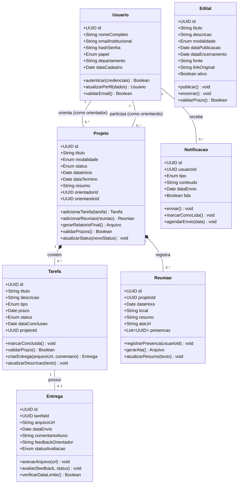
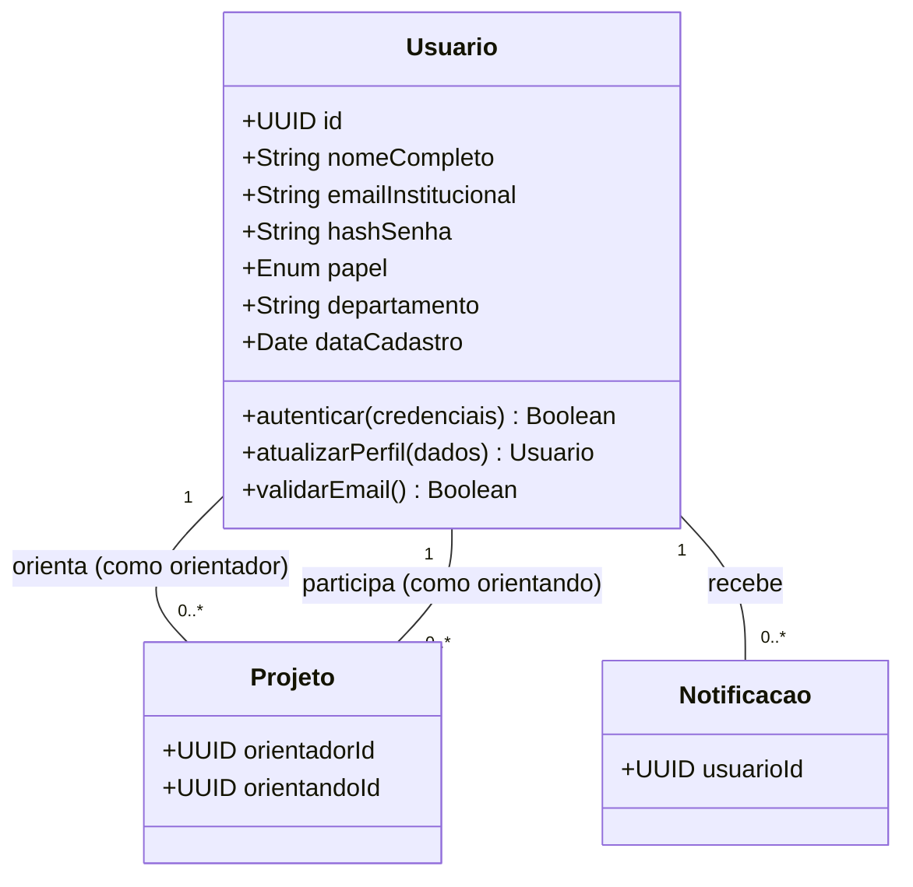
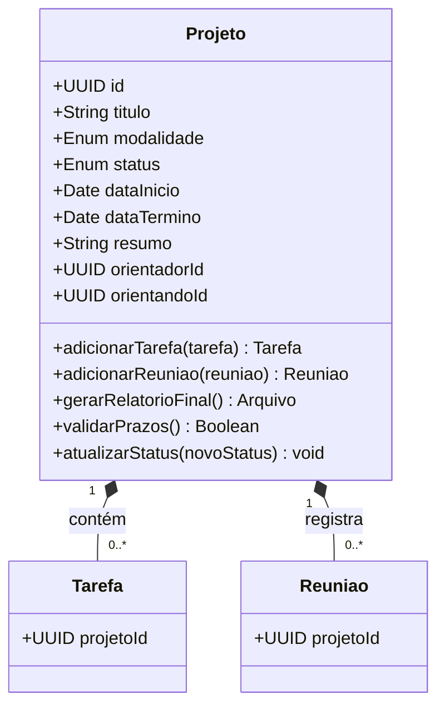
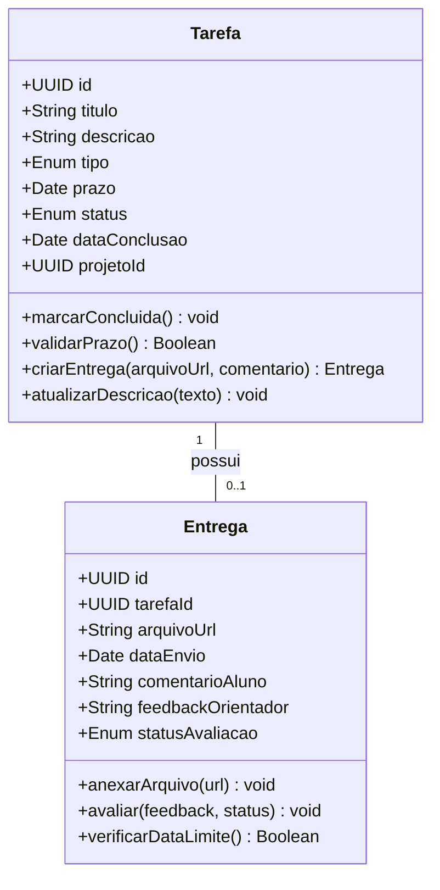
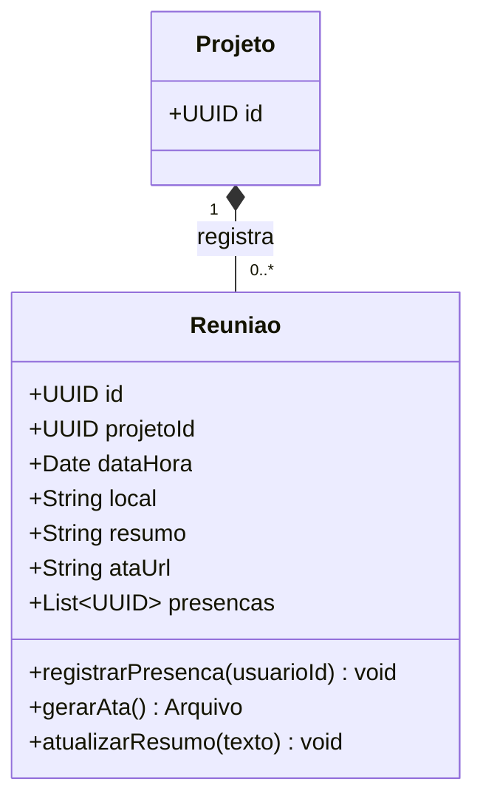
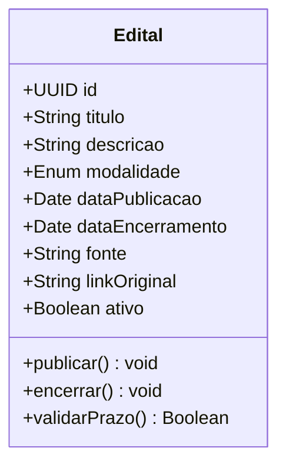
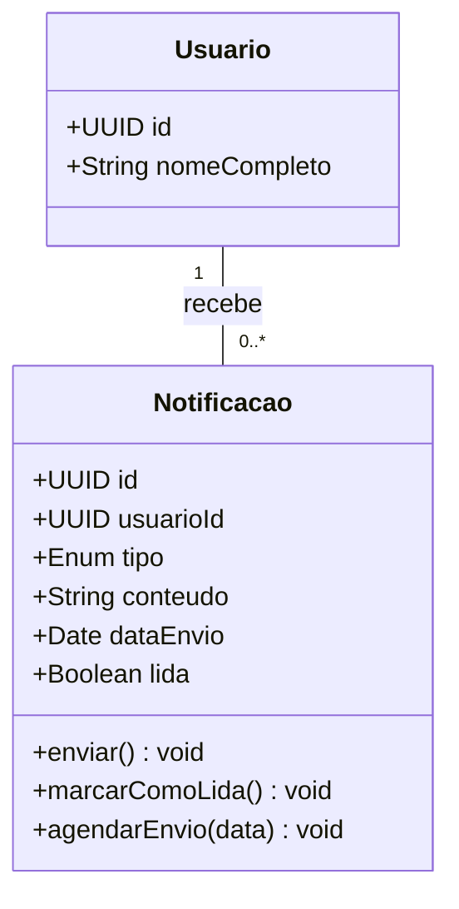

# Diagrama de Código (Classes UML)

**E-Project** · C4 Model · Nível 4

---

---

## 6.1 Visão Geral do Diagrama

O **Diagrama de Código** é o quarto e mais granular nível do modelo C4. Ele desce até o nível da implementação, apresentando a estrutura interna de classes, atributos, métodos e relações de um componente específico do sistema.

Este diagrama não tem o objetivo de representar todo o código-fonte do E-Project. Ao invés disso, ele detalha as **classes centrais do domínio de negócio** que sustentam o funcionamento da aplicação, mostrando como os dados são modelados, como as entidades se relacionam e quais operações cada classe executa.

O foco aqui é o **módulo de Gestão de Projetos** da API Backend (container Node.js/Express + TypeScript hospedado no Railway), pois ele representa o coração do sistema — englobando projetos, tarefas, entregas, reuniões, editais e notificações — e é o componente com maior complexidade de domínio do E-Project.

---

## 6.2 Explicação Geral do Diagrama

O diagrama de classes do E-Project organiza as entidades centrais do domínio em **seis classes principais**: `Usuario`, `Projeto`, `Tarefa`, `Entrega`, `Reuniao`, `Edital` e `Notificacao`. Cada classe corresponde diretamente a um conceito do domínio acadêmico da UFAM e tem responsabilidades bem delimitadas.

A arquitetura em camadas adotada pelo E-Project (Nível 1 — Padrões Arquiteturais) reflete-se diretamente aqui:

- As classes representam a **Camada de Domínio (Model)** — a camada mais interna, sem dependência de frameworks ou interfaces.
- Os atributos de cada classe são persistidos no **PostgreSQL via Prisma ORM** (Camada de Infraestrutura).
- Os métodos de cada classe encapsulam as **regras de negócio** executadas pela API RESTful (Camada de Aplicação).

As relações entre classes seguem os padrões de associação e composição UML:

- `Projeto` possui composição com `Tarefa` e `Reuniao` — a existência dessas depende do projeto.
- `Tarefa` possui associação com `Entrega` — uma tarefa pode ter zero ou uma entrega.
- `Usuario` se associa a `Projeto` em dois papéis distintos: como orientador e como orientando.
- `Usuario` recebe `Notificacao` — cada alerta é direcionado a um usuário específico.
- `Edital` existe de forma independente, sendo gerenciado pelo Administrador ou coletado dos portais da UFAM.

---

## 6.3 Diagrama Completo — Visão Geral

**Figura 1 — Diagrama de Classes UML completo do E-Project, representando as sete entidades centrais do domínio de negócio, seus atributos, métodos e relações. O diagrama cobre o módulo de Gestão de Projetos da API Backend (TypeScript/Node.js).**

---

## 6.4 Detalhamento por Partes

### Parte 1 — Classe `Usuario` (Autenticação e Perfis)

A classe `Usuario` é a base de todo o controle de acesso do E-Project. Ela centraliza a identidade digital dos atores do sistema e utiliza um campo `papel` (`Enum: PROFESSOR | ALUNO | ADMINISTRADOR`) para diferenciar permissões sem criar subclasses desnecessárias, mantendo o modelo flexível para futuros perfis institucionais.

A autenticação é delegada ao **Firebase Authentication**, mas a classe `Usuario` persiste os dados necessários para o controle de acesso local no PostgreSQL via Prisma ORM.

**Figura 2 — Classe `Usuario` e suas associações. Representa a identidade digital dos atores do sistema e sua vinculação com projetos e notificações.**

**Explicação dos métodos:**

- `autenticar(credenciais)`: valida as credenciais contra o Firebase Authentication e retorna o token JWT para controle de acesso nas rotas protegidas da API;
- `atualizarPerfil(dados)`: permite ao usuário modificar dados pessoais e preferências, persistindo as alterações via Prisma ORM no PostgreSQL;
- `validarEmail()`: garante que apenas e-mails institucionais da UFAM (`@ufam.edu.br`) sejam aceitos no cadastro, bloqueando registros externos.

---

### Parte 2 — Classe `Projeto` (Núcleo do Domínio)

A classe `Projeto` é o eixo central do E-Project. Ela agrega todas as informações relativas a uma iniciativa acadêmica e mantém o controle sobre seu ciclo de vida completo — desde a submissão até a conclusão. Suporta as modalidades **PIBIC, PIBITI, PIBEX, PACE e Pós-Graduação**, refletindo diretamente os requisitos institucionais da UFAM.

**Figura 3 — Classe `Projeto` como agregadora de `Tarefas` e `Reuniões`. Representa o contrato acadêmico entre orientador e orientando e o ciclo de vida do projeto.**

**Explicação dos métodos:**

- `adicionarTarefa(tarefa)`: cria uma nova tarefa vinculada ao projeto e aciona o Componente de Notificações para alertar o aluno;
- `adicionarReuniao(reuniao)`: registra um encontro de orientação e o associa ao histórico do projeto;
- `gerarRelatorioFinal()`: aciona o **Serviço de Geração de PDF (PDFKit)** para consolidar dados do projeto, tarefas concluídas e atas de reunião em um documento no padrão institucional da UFAM;
- `validarPrazos()`: verifica se o projeto está dentro do período de vigência da modalidade acadêmica, retornando `false` em caso de prazo expirado;
- `atualizarStatus(novoStatus)`: altera o estado do projeto entre os valores `EM_ANDAMENTO`, `PENDENTE`, `CONCLUIDO` e `CANCELADO`.

---

### Parte 3 — Classes `Tarefa` e `Entrega` (Fluxo Operacional do Aluno)

O par `Tarefa`/`Entrega` representa o fluxo operacional do dia a dia da orientação. O professor cria tarefas com prazos, o aluno submete entregas vinculadas a cada tarefa, e o professor avalia o material enviado. O Componente de Tarefas aciona notificações push via **Firebase Cloud Messaging (FCM)** quando prazos se aproximam.

**Figura 4 — Classes `Tarefa` e `Entrega` representando o fluxo operacional de submissão e avaliação de atividades acadêmicas.**

**Explicação dos métodos — `Tarefa`:**

- `marcarConcluida()`: altera o campo `status` para `CONCLUIDO` e registra a `dataConclusao` automaticamente;
- `validarPrazo()`: compara a data atual com o campo `prazo`, retornando `false` e disparando uma notificação se houver atraso;
- `criarEntrega(arquivoUrl, comentario)`: instancia um objeto `Entrega` vinculado à tarefa, persistindo a URL do arquivo gerado pelo Serviço de PDF ou enviado pelo aluno;
- `atualizarDescricao(texto)`: permite ao professor refinar as instruções da tarefa após sua criação.

**Explicação dos métodos — `Entrega`:**

- `anexarArquivo(url)`: recebe a URL do arquivo armazenado pelo backend (Railway) e a persiste no registro de entrega;
- `avaliar(feedback, status)`: permite ao professor registrar o `feedbackOrientador` e alterar o `statusAvaliacao` para `APROVADA` ou `NECESSITA_AJUSTE`;
- `verificarDataLimite()`: valida se a entrega foi realizada dentro do prazo definido na tarefa vinculada.

---

### Parte 4 — Classe `Reuniao` (Registro de Orientações)

A classe `Reuniao` representa os encontros formais entre professor e aluno durante o projeto. Ela é o mecanismo de registro de presença e de produção de atas institucionais, geradas automaticamente via **PDFKit** no formato padrão da UFAM.

**Figura 5 — Classe `Reuniao` e sua composição com `Projeto`. Representa os encontros de orientação e o controle de frequência dos alunos.**

**Explicação dos métodos:**

- `registrarPresenca(usuarioId)`: adiciona o `id` do usuário à lista `presencas`, evitando duplicatas e integrando com o Componente de Presença;
- `gerarAta()`: aciona o **Serviço de Geração de PDF (PDFKit)** para produzir uma ata com os dados da reunião, lista de presentes e resumo da discussão, retornando a URL do documento gerado;
- `atualizarResumo(texto)`: permite ao orientador descrever os tópicos discutidos no encontro, enriquecendo o histórico do projeto.

---

### Parte 5 — Classe `Edital` (Feed Institucional)

A classe `Edital` representa as oportunidades institucionais disponibilizadas pelas Pró-Reitorias da UFAM. Ela é gerenciada pelo **Componente de Feed de Editais** (Nível 3 — Componentes), que coleta dados dos portais externos e os normaliza nesta entidade para consumo centralizado na plataforma.

**Figura 6 — Classe `Edital` representando as oportunidades institucionais disponibilizadas no feed centralizado do E-Project.**

**Explicação dos métodos:**

- `publicar()`: ativa o edital na plataforma, tornando-o visível para professores e alunos, e aciona uma notificação push via **FCM** para todos os usuários;
- `encerrar()`: altera o campo `ativo` para `false` ao atingir a `dataEncerramento`, removendo o edital do feed ativo;
- `validarPrazo()`: verifica se o edital ainda está dentro do prazo de inscrições, auxiliando na filtragem do feed.

---

### Parte 6 — Classe `Notificacao` (Serviço de Alertas)

A classe `Notificacao` desacopla o envio de alertas do restante do domínio. Ela é acionada pelos Componentes de Projetos, Tarefas e Presença (Nível 3 — Componentes) e utiliza o **Firebase Cloud Messaging (FCM)** para entrega de notificações push, conforme definido no Tech Stack (Nível 2).

**Figura 7 — Classe `Notificacao` representando o sistema de alertas e comunicação assíncrona com os usuários via Firebase Cloud Messaging.**

**Explicação dos métodos:**

- `enviar()`: dispara a notificação pelo canal FCM e registra a `dataEnvio`, garantindo rastreabilidade do alerta;
- `marcarComoLida()`: atualiza o campo `lida` para `true`, removendo o alerta da caixa de entrada ativa do usuário na PWA;
- `agendarEnvio(data)`: permite programar o envio da notificação para uma data futura — útil para lembretes automáticos de prazo de tarefas e encerramento de editais.

---

## 6.5 Tabela de Relações entre Classes

| Origem | Destino | Tipo de Relação | Multiplicidade | Descrição |
|:---|:---|:---|:---|:---|
| `Usuario` | `Projeto` | Associação (orientador) | 1 para 0..* | Um professor pode orientar vários projetos |
| `Usuario` | `Projeto` | Associação (orientando) | 1 para 0..* | Um aluno pode participar de vários projetos |
| `Usuario` | `Notificacao` | Associação | 1 para 0..* | Um usuário recebe múltiplas notificações |
| `Projeto` | `Tarefa` | Composição | 1 para 0..* | Tarefas existem apenas dentro de um projeto |
| `Projeto` | `Reuniao` | Composição | 1 para 0..* | Reuniões existem apenas dentro de um projeto |
| `Tarefa` | `Entrega` | Associação | 1 para 0..1 | Uma tarefa pode ter no máximo uma entrega |
| `Edital` | — | Independente | — | Entidade autônoma gerenciada pelo Administrador |

---

## 6.6 Rastreabilidade com Histórias de Usuário

A tabela a seguir evidencia como as classes do diagrama de código se alinham diretamente às histórias de usuário definidas no backlog do E-Project (TP1):

| Classe | Histórias de Usuário | Descrição do Alinhamento |
|:---|:---|:---|
| `Usuario` | US-01, US-09, US-13 | Suporta login, validação de e-mail institucional e gerenciamento de perfis por papel (Professor, Aluno, Administrador) |
| `Projeto` | US-02, US-03, US-08 | Permite criação, acompanhamento, atualização de status e encerramento de projetos por modalidade acadêmica |
| `Tarefa` | US-04, US-06, US-10, US-14 | Gerencia o ciclo de vida das tarefas no fluxo Kanban, incluindo atribuição, prazos e atualização de status |
| `Entrega` | US-04, US-07 | Representa a submissão de materiais pelo aluno e o processo de avaliação pelo professor orientador |
| `Reuniao` | US-06 | Registra check-ins em reuniões de orientação e gera atas automáticas no padrão UFAM via PDFKit |
| `Edital` | US-11 | Centraliza e disponibiliza editais coletados dos portais da UFAM e cadastrados pelo Administrador |
| `Notificacao` | US-05, US-12 | Dispara alertas de prazos iminentes, novas tarefas, atualizações de status e editais publicados via FCM |

---

## 6.7 Considerações Finais

O Diagrama de Código evidencia como a **Camada de Domínio** do E-Project está estruturada de forma coesa e alinhada com os demais níveis do modelo C4:

- As **sete classes** (`Usuario`, `Projeto`, `Tarefa`, `Entrega`, `Reuniao`, `Edital` e `Notificacao`) cobrem integralmente os módulos identificados no Diagrama de Componentes (Nível 3), garantindo consistência vertical entre os níveis.
- A classe `Projeto` com composição sobre `Tarefa` e `Reuniao` reflete a decisão arquitetural de **Arquitetura em Camadas** adotada no padrão MVC: entidades de domínio sem dependência de frameworks ou interfaces.
- A ausência de dependências diretas das classes ao **Firebase**, **Prisma** ou **PDFKit** é intencional — esses serviços pertencem à Camada de Infraestrutura e são acessados pela Camada de Aplicação (API RESTful), mantendo a independência do domínio.
- A classe `Edital`, anteriormente ausente, foi adicionada para garantir **rastreabilidade completa** com o Componente de Feed de Editais (Nível 3) e a história de usuário US-11.
- O atributo `arquivoUrl` na classe `Entrega` aponta para arquivos gerados ou armazenados pelo backend (Railway), alinhando-se ao tech stack definido — sem dependência de serviços externos como AWS S3.

Essa estrutura de domínio sustenta a implementação TypeScript da API RESTful hospedada no Railway, com tipagem segura via Prisma ORM e persistência no PostgreSQL.

---

**Universidade Federal do Amazonas — ICET | Engenharia de Software I | 2026**

