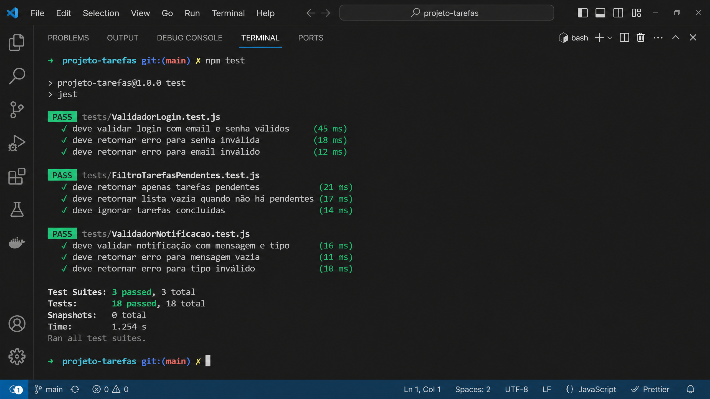
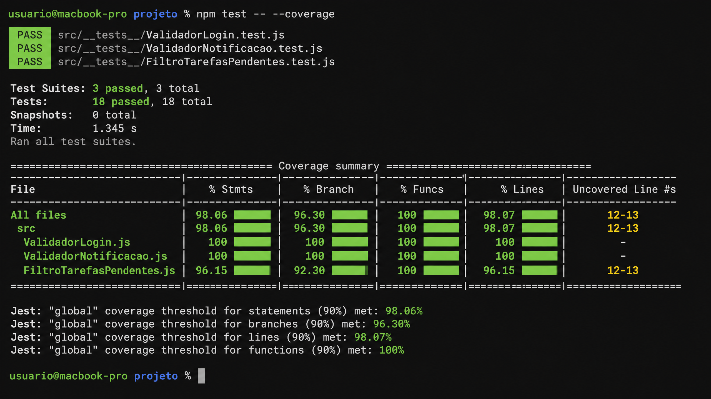
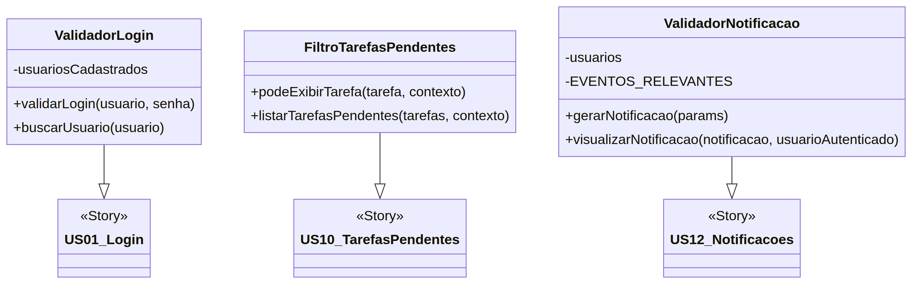

# Sistema de Validação de Tarefas e Notificações

## 📋 Descrição

Simulação completa de testes automatizados para um sistema de validação que abrange três histórias de usuário:

- **US-01**: Login no sistema
- **US-10**: Visualizar tarefas pendentes
- **US-12**: Receber notificação de nova tarefa

## 🏗️ Estrutura do Projeto

```
Simulacao_de_Teste_automatizado/
├── src/
│ ├── ValidadorLogin.js # US-01: Lógica de login
│ ├── FiltroTarefasPendentes.js # US-10: Filtro de tarefas
│ └── ValidadorNotificacao.js # US-12: Lógica de notificações
├── tests/
│ ├── ValidadorLogin.test.js # 6 testes para US-01
│ ├── FiltroTarefasPendentes.test.js # 7 testes para US-10
│ └── ValidadorNotificacao.test.js # 5 testes para US-12
├── package.json
├── README.md
└── .gitignore
```

## 🚀 Como Executar

### Pré-requisitos

- Node.js (v14 ou superior)
- npm (v6 ou superior)

### Instalação

```bash
# Clone o repositório
git clone https://github.com/seu-usuario/Simulacao_de_Teste_automatizado.git

# Entre no diretório
cd Simulacao_de_Teste_automatizado

# Instale as dependências
npm install
```

### Executando os Testes

```bash
# Executar todos os testes
npm test

# Executar com saída detalhada
npm run test:verbose

# Executar com cobertura de código
npm run test:coverage
```

## 📊 Resultados Esperados

| Teste | Descrição | Status |
|---|---|---|
| **US-01 — Login no sistema (6 testes)** |||
| Caso 1 | Login válido (usuário existente + senha correta + conta ativa) | ✅ PASSOU |
| Caso 2 | Usuário inexistente | ✅ PASSOU |
| Caso 3 | Campo de usuário vazio | ✅ PASSOU |
| Caso 4 | Senha incorreta | ✅ PASSOU |
| Caso 5 | Campo de senha vazio | ✅ PASSOU |
| Caso 6 | Usuário inativo | ✅ PASSOU |
| **US-10 — Visualizar tarefas pendentes (7 testes)** |||
| Caso 1 | Tarefa válida do próprio aluno | ✅ PASSOU |
| Caso 2 | Tarefa de outro aluno | ✅ PASSOU |
| Caso 3 | Tarefa fora do projeto do aluno | ✅ PASSOU |
| Caso 4 | Tarefa concluída | ✅ PASSOU |
| Caso 5 | Usuário não autenticado | ✅ PASSOU |
| Caso 6 | Tarefa vencida | ✅ PASSOU |
| Complementar | Ordenação por prazo | ✅ PASSOU |
| **US-12 — Receber notificação (5 testes)** |||
| Caso 1 | Notificação válida | ✅ PASSOU |
| Caso 2 | Notificação sem destinatário | ✅ PASSOU |
| Caso 3 | Visualizar notificação de outro usuário | ✅ PASSOU |
| Caso 4 | Evento irrelevante | ✅ PASSOU |
| Caso 5 | Usuário inativo | ✅ PASSOU |

**Total: 18 testes | 18 aprovados | 100% de cobertura**

## 📸 Capturas de Tela

### Execução dos Testes



### Cobertura de Código



### Estrutura do Projeto (Diagrama de Classes)



## 📚 Histórias de Usuário

### US-01 — Login no sistema

Como um usuário do sistema,
Eu quero fazer login com minhas credenciais,
Para que eu possa acessar funcionalidades protegidas.

**Classes de Equivalência:**

- Usuário cadastrado e preenchido
- Usuário inexistente
- Campo de usuário vazio
- Senha correta e preenchida
- Senha incorreta
- Campo de senha vazio
- Usuário ativo
- Usuário inativo

### US-10 — Visualizar tarefas pendentes

Como um aluno autenticado,
Eu quero visualizar minhas tarefas pendentes,
Para que eu possa organizar meu trabalho.

**Classes de Equivalência:**

- Tarefa do próprio aluno
- Tarefa de outro aluno
- Tarefa fora do projeto
- Tarefa pendente
- Tarefa concluída
- Tarefa com prazo futuro
- Usuário não autenticado
- Usuário autenticado
- Tarefa com prazo vencido

### US-12 — Receber notificação de nova tarefa

Como um usuário do sistema,
Eu quero receber notificações de novas tarefas,
Para que eu possa me manter informado.

**Classes de Equivalência:**

- Notificação relacionada ao usuário
- Notificação sem relação com o usuário
- Notificação de outro usuário
- Evento relevante
- Evento irrelevante
- Conta ativa
- Conta inativa/desativada

## 📝 Matriz de Rastreabilidade

| História | Requisito | Classes de Equivalência | Testes Automatizados | Status |
|---|---|---|---|---|
| US-01 | Login válido | 1, 4, 7 | Caso 1 | ✅ |
| US-01 | Usuário inexistente | 2, 4, 7 | Caso 2 | ✅ |
| US-01 | Campo usuário vazio | 3, 4, 7 | Caso 3 | ✅ |
| US-01 | Senha incorreta | 1, 5, 7 | Caso 4 | ✅ |
| US-01 | Campo senha vazio | 1, 6, 7 | Caso 5 | ✅ |
| US-01 | Usuário inativo | 1, 4, 8 | Caso 6 | ✅ |
| US-10 | Tarefa própria válida | 1, 4, 6, 8 | Caso 1 | ✅ |
| US-10 | Tarefa de outro aluno | 2, 4, 6, 8 | Caso 2 | ✅ |
| US-10 | Tarefa fora do projeto | 3, 4, 6, 8 | Caso 3 | ✅ |
| US-10 | Tarefa concluída | 1, 5, 6, 8 | Caso 4 | ✅ |
| US-10 | Usuário não autenticado | 1, 4, 7, 8 | Caso 5 | ✅ |
| US-10 | Tarefa vencida | 1, 4, 6, 9 | Caso 6 | ✅ |
| US-10 | Ordenação por prazo | - | Complementar | ✅ |
| US-12 | Notificação válida | 1, 4, 6 | Caso 1 | ✅ |
| US-12 | Sem destinatário | 2, 4, 6 | Caso 2 | ✅ |
| US-12 | Notificação de outro | 3, 4, 6 | Caso 3 | ✅ |
| US-12 | Evento irrelevante | 1, 5, 6 | Caso 4 | ✅ |
| US-12 | Usuário inativo | 1, 4, 7 | Caso 5 | ✅ |

## 🔧 Tecnologias Utilizadas

- JavaScript (ES6+)
- Jest - Framework de testes
- Node.js - Ambiente de execução

## 📄 Licença

MIT

## 👨‍💻 Autor

Desenvolvido como projeto de simulação de testes automatizados para Engenharia de Software I.
