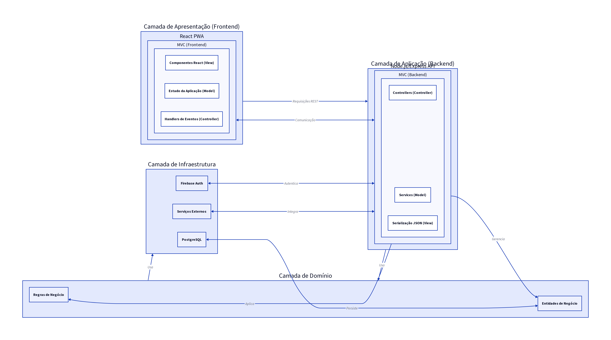

# 1. Padrões Arquiteturais

## 1.1. Arquitetura em Camadas

### Descrição
A **Arquitetura em Camadas** (Layered Architecture) é um padrão que organiza o sistema em camadas lógicas, cada uma com responsabilidades específicas e comunicação restrita às camadas adjacentes. Essa estrutura promove a separação de interesses, modularidade e facilita a manutenção e evolução do software [1]. Tipicamente, as camadas incluem Apresentação (interface do usuário), Aplicação (lógica de negócio), Domínio (regras de negócio e entidades) e Infraestrutura (acesso a dados, serviços externos).

### Justificativa para o E-Project
Para o E-Project, a Arquitetura em Camadas é uma escolha estratégica, pois permite organizar um sistema complexo em partes gerenciáveis. A clara separação de responsabilidades entre as camadas de interface, lógica de negócio e persistência de dados possibilita que diferentes equipes trabalhem em paralelo com mínima dependência. Isso é fundamental para um projeto que abrange diversas funcionalidades (gestão de projetos, tarefas, usuários, documentos) e múltiplos perfis de usuário (professor, estudante, administrador). Adicionalmente, a modularidade facilita a substituição ou atualização de componentes em uma camada sem impactar significativamente as outras, assegurando a **manutenibilidade** e **escalabilidade** do sistema a longo prazo.

### Aplicação no Sistema
No E-Project, a Arquitetura em Camadas será aplicada da seguinte forma:

*   **Camada de Apresentação (Frontend):** Responsável pela interface do usuário. Será desenvolvida utilizando React (PWA), proporcionando a interação visual para professores, estudantes e administradores. Esta camada se comunicará com a Camada de Aplicação por meio de APIs REST.
*   **Camada de Aplicação (Backend):** Contém a lógica de negócio principal e orquestra as operações. Implementada com Node.js/Express, receberá requisições da camada de apresentação, coordenará as interações com as camadas de domínio e infraestrutura, e retornará as respostas apropriadas.
*   **Camada de Domínio:** Engloba as entidades de negócio (por exemplo, Projeto, Usuário, Orientação, Tarefa) e as regras de negócio específicas do E-Project. Esta camada é agnóstica a tecnologias de persistência e apresentação.
*   **Camada de Infraestrutura:** Responsável pela persistência de dados e integração com serviços externos. Incluirá o PostgreSQL para o banco de dados, Firebase Auth para autenticação e possíveis integrações com serviços de e-mail ou sistemas da UFAM.

## 1.2. Padrão MVC (Model-View-Controller)

### Descrição
O padrão **Model-View-Controller (MVC)** divide uma aplicação em três componentes interconectados, separando a representação da informação das interações do usuário [2].

*   **Model (Modelo):** Representa os dados e a lógica de negócio. É responsável por gerenciar o estado da aplicação e as regras de negócio, independentemente da interface do usuário.
*   **View (Visão):** É a interface do usuário, responsável por exibir os dados do Modelo. Ela não contém lógica de negócio, apenas apresenta as informações de forma visual.
*   **Controller (Controlador):** Atua como um intermediário entre o Modelo e a Visão. Ele recebe as entradas do usuário da Visão, processa-as (interagindo com o Modelo quando necessário) e atualiza a Visão com os resultados.

### Justificativa para o E-Project
O padrão MVC complementa a Arquitetura em Camadas, especialmente nas camadas de Apresentação e Aplicação. Para o E-Project, o MVC oferece uma estrutura clara para o desenvolvimento do frontend (React) e do backend (Node.js/Express). A separação entre Model, View e Controller facilita o desenvolvimento paralelo de componentes da interface e da lógica de negócio, melhorando a organização do código e a testabilidade. Por exemplo, a lógica de negócio pode ser testada independentemente da interface do usuário, e a interface pode ser modificada sem afetar a lógica subjacente. Isso é particularmente benéfico para um projeto com uma interface rica e funcionalidades complexas, garantindo um desenvolvimento mais ágil e robusto.

### Aplicação no Sistema
No E-Project, o padrão MVC será aplicado da seguinte forma:

*   **No Frontend (React PWA)**: Embora o React não siga estritamente o MVC tradicional, seus conceitos podem ser adaptados. Componentes React atuam como Views, exibindo dados. O estado da aplicação (Model) é gerenciado por bibliotecas como Redux ou Context API, e as interações do usuário (Controller) são tratadas por *handlers* de eventos nos componentes, que disparam ações para atualizar o estado.
*   **No Backend (Node.js/Express)**: O Express.js é frequentemente utilizado com uma estrutura MVC. Os Controllers receberão as requisições HTTP, invocarão os Services (que representam o Model, contendo a lógica de negócio e interagindo com o banco de dados) e prepararão as respostas. As Views, neste contexto, podem ser *templates* para renderização de páginas (se houver) ou, mais comumente em APIs REST, a serialização dos dados do Model para JSON.

## Referências
[1] Arquitetura em Camadas (Layered architecture) - DEV Community. Disponível em: [https://dev.to/yuripeixinho/arquitetura-em-camadas-layered-architecture-a68](https://dev.to/yuripeixinho/arquitetura-em-camadas-layered-architecture-a68)
[2] Arquitetura MVC: Entendendo o Modelo-Visão-Controlador - DIO. Disponível em: [https://www.dio.me/articles/arquitetura-mvc-entendendo-o-modelo-visao-controlador](https://www.dio.me/articles/arquitetura-mvc-entendendo-o-modelo-visao-controlador)

## 1.3. Figura da Arquitetura

**Legenda:** Diagrama representando a arquitetura em camadas do E-Project, com destaque para a aplicação do padrão MVC nas camadas de Apresentação e Aplicação.
