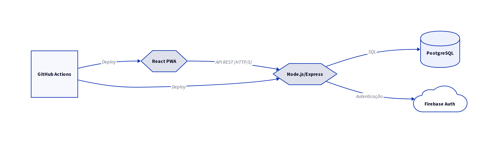

# 🛠️ Tech Stack — E-Project
*Mapa completo das tecnologias que compõem o E-Project*

---

### 🖥️ Frontend & UI

### ⚙️ Backend & API

### 🗄️ Banco de Dados & Autenticação

### ☁️ Infraestrutura & Deploy

### 🔔 Notificações & Documentos

---

> 💡 Stack construída para rodar como **PWA full-stack JavaScript** — do frontend reativo até a geração automática de documentos oficiais da UFAM.

---

# 2. Tech Stack

## 2.1. Tecnologias Previstas

O E-Project será desenvolvido com um conjunto de tecnologias modernas e robustas, selecionadas para garantir escalabilidade, manutenibilidade e uma excelente experiência de usuário. A *stack* tecnológica abrange desde o *frontend* até o *backend*, banco de dados, autenticação, notificações, geração de documentos, hospedagem e processos de CI/CD.

### Frontend
- **React (PWA):** Um *framework* JavaScript para construção de interfaces de usuário reativas e eficientes. A implementação como *Progressive Web App* (PWA) permitirá que o aplicativo seja instalado em dispositivos móveis e *desktops*, oferecendo uma experiência similar a um aplicativo nativo, com funcionalidades *offline* e notificações.

### Backend
- **Node.js/Express:** Node.js será o ambiente de execução JavaScript no lado do servidor, e Express.js será o *framework* web para construir a API RESTful. Essa combinação é ideal para aplicações de alta performance e escaláveis, permitindo o uso de JavaScript em toda a *stack* (*full-stack* JavaScript).

### Banco de Dados
- **PostgreSQL:** Um sistema de gerenciamento de banco de dados relacional (SGBDR) de código aberto, conhecido por sua robustez, confiabilidade, desempenho e suporte a recursos avançados. Será utilizado para armazenar dados estruturados do E-Project, como informações de usuários, projetos, tarefas e documentos. A escolha também atende ao padrão ePING do governo federal.

### Autenticação
- **Firebase Authentication:** Serviço de autenticação fornecido pelo Google Firebase, que oferece uma solução segura e escalável para gerenciar usuários. Suporta diversos métodos de *login* (e-mail/senha, Google, etc.) e simplifica a implementação de autenticação no aplicativo, com suporte a JWT para o MVP e modularidade para futura implementação de OAuth2/SSO.

### CI/CD
- **GitHub Actions:** Plataforma de integração contínua e entrega contínua (CI/CD) integrada ao GitHub. Será utilizada para automatizar o processo de *build*, teste e *deploy* do E-Project, garantindo que as alterações de código sejam entregues de forma rápida e confiável.

### Hospedagem — Frontend
- **Vercel:** Plataforma de hospedagem em nuvem especializada em aplicações frontend com deploy automático integrado ao GitHub. Responsável por hospedar o React PWA com entregas automáticas a cada commit, garantindo disponibilidade e performance para os usuários.

### Hospedagem — Backend
- **Railway:** Plataforma de hospedagem em nuvem para aplicações backend com deploy automático integrado ao GitHub. Responsável por hospedar o servidor Node.js/Express e o banco PostgreSQL no mesmo ambiente, simplificando a configuração e garantindo a comunicação entre o backend e o banco de dados.

### Notificação
- **Firebase Cloud Messaging (FCM):** Serviço de notificações push em nuvem do Google, integrado ao ecossistema Firebase. Responsável pelo envio de notificações em tempo real para os usuários, alertando sobre novas tarefas, prazos e atualizações dos projetos sem precisar abrir o aplicativo.

### Geração de PDF
- **PDFKit:** Biblioteca JavaScript para geração de documentos PDF diretamente pelo código, sem dependências externas. Utilizada para a geração automática de relatórios parciais e declarações de bolsista, eliminando o preenchimento manual e reduzindo erros nos documentos oficiais.

---

## 2.2. Explicação das Integrações

A arquitetura do E-Project é projetada para ser modular e com integrações bem definidas entre os componentes. O **Frontend (React PWA)** se comunicará com o **Backend (Node.js/Express)** exclusivamente por meio de requisições HTTP para a API RESTful. O *Backend*, por sua vez, será responsável por interagir com o **PostgreSQL** para operações de persistência de dados, com o **Firebase Authentication** para gerenciar a autenticação e autorização dos usuários, com o **Firebase Cloud Messaging** para o disparo de notificações push, e com o **PDFKit** para a geração automática de documentos oficiais. O **GitHub Actions** orquestrará o *pipeline* de CI/CD, automatizando a implantação de novas versões do *Frontend* na **Vercel** e do *Backend* no **Railway**.

---

## 2.3. Tabela de Tecnologias por Camada

| Camada | Tecnologia | Justificativa |
|:---|:---|:---|
| Frontend | React (PWA) | Interface de usuário reativa, experiência de aplicativo nativo, funcionalidades offline. |
| Backend | Node.js/Express | Ambiente de execução JavaScript de alta performance, framework web robusto para API RESTful. |
| Banco de Dados | PostgreSQL | SGBDR confiável, escalável e com recursos avançados para dados estruturados. Conformidade com ePING. |
| Autenticação | Firebase Authentication | Solução de autenticação segura, escalável e de fácil integração. Suporte a JWT e futura expansão para OAuth2/SSO. |
| CI/CD | GitHub Actions | Automação de build, teste e deploy, garantindo entregas rápidas e confiáveis. |
| Hospedagem Frontend | Vercel | Hospedagem especializada em frontend com deploy contínuo integrado ao GitHub. |
| Hospedagem Backend | Railway | Hospedagem do servidor e banco de dados no mesmo ambiente, simplificando a configuração. |
| Notificação | Firebase Cloud Messaging (FCM) | Envio de notificações push em tempo real sem necessidade de abrir o aplicativo. |
| Geração de PDF | PDFKit | Geração automática de documentos oficiais diretamente pelo código, sem dependências externas. |

**Legenda:** Diagrama representando as principais tecnologias utilizadas no E-Project e suas interações.

**Legenda:** Diagrama representando as principais tecnologias utilizadas no E-Project e suas interações.
