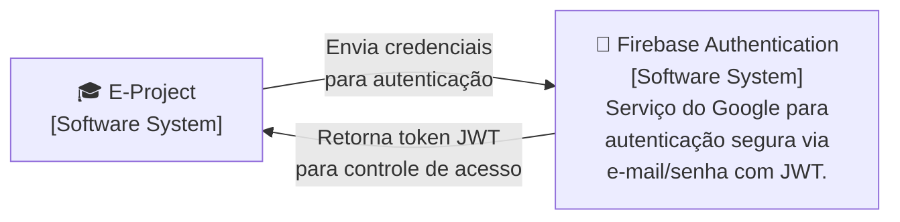
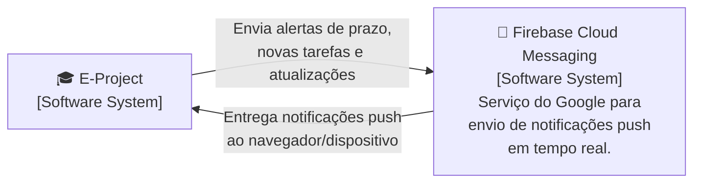

<div align="center">

# Diagrama de Contexto

**E-Project** · C4 Model · Nível 1


</div>

---

## 3.1 Visão Geral do Diagrama

O **Diagrama de Contexto** é o primeiro e mais alto nível do modelo C4. Ele representa o sistema como uma única "caixa preta" e tem como objetivo mostrar **quem interage com o sistema** (atores/usuários) e **quais sistemas externos** se relacionam com ele.

Neste nível, não há preocupação com a estrutura interna do E-Project. O foco está em delimitar as fronteiras do sistema, identificar seus usuários diretos e mapear as dependências externas necessárias para seu funcionamento.

---

## 3.2 Explicação Geral do Diagrama Modelado para o Sistema

O **E-Project** é uma plataforma web PWA voltada à gestão de projetos acadêmicos da UFAM. No diagrama de contexto, ele aparece como o sistema central, conectado a três grupos de atores e dois sistemas externos do ecossistema Firebase.

### 👥 Atores que interagem diretamente com o sistema

| Ator | Descrição |
|------|-----------|
| **Professor Orientador** | Acompanha projetos, revisa tarefas, monitora prazos, gera documentos e visualiza o progresso dos orientandos |
| **Aluno Orientando** | Executa tarefas, envia entregas, registra presença em reuniões e acompanha o andamento do projeto |
| **Administrador / Coordenador** | Gerencia contas e permissões de usuários, publica e atualiza editais institucionais, e audita métricas e logs do sistema |

### 🔌 Sistemas externos integrados

| Sistema | Tipo | Papel |
|---------|------|-------|
| **Firebase Authentication** | Software System | Autenticação segura via e-mail/senha com suporte a JWT |
| **Firebase Cloud Messaging (FCM)** | Software System | Envio de notificações push em tempo real aos usuários |

O diagrama evidencia que o E-Project atua como um **hub centralizador** no ecossistema acadêmico da UFAM, eliminando a necessidade de os usuários acessarem múltiplos sistemas e ferramentas genéricas.

> ⚠️ **Nota sobre MVP:** A integração com os Portais Institucionais da UFAM (PROPESP/PROEXT) está prevista para uma fase posterior ao MVP e, por isso, não consta neste diagrama.


---

## 3.3 Diagrama de Contexto — Visão Completa

```mermaid
flowchart TB
    professor["👨‍🏫 Professor Orientador\n[Person]\nAcompanha projetos, tarefas,\nprazos e documentos dos orientandos.\nGera relatórios."]

    aluno["👨‍🎓 Aluno Orientando\n[Person]\nExecuta tarefas, envia documentos,\nregistra presença em reuniões\ne acompanha prazos do projeto."]

    admin["🛠️ Administrador / Coordenador\n[Person]\nGerencia contas de usuários,\npublica editais institucionais,\ne audita métricas e logs."]

    eproject["🎓 E-Project\n[Software System]\nPlataforma web PWA para\ncentralização e gestão de projetos\nacadêmicos da UFAM.\nModalidades: PIBIC, PIBITI, PIBEX, PACE, Pós-Graduação."]

    firebaseauth["🔐 Firebase Authentication\n[Software System]\nServiço do Google para autenticação\nsegura dos usuários via e-mail/senha\ncom suporte a JWT."]

    fcm["🔔 Firebase Cloud Messaging\n[Software System]\nServiço do Google para envio de\nnotificações push em tempo real\naos usuários do sistema."]

    professor -- "Gerencia projetos, tarefas,\ndocumentos e orientandos" --> eproject
    aluno -- "Executa tarefas, envia\narquivos e registra presença" --> eproject
    admin -- "Gerencia acessos, publica editais\ne visualiza métricas/logs" --> eproject

    eproject -- "Autentica usuários\nvia e-mail/senha (JWT)" --> firebaseauth
    eproject -- "Envia notificações push\nde prazos e atualizações" --> fcm

**Figura 2 —** Interações do Professor Orientador com o E-Project.

---

### Parte 2 — Aluno Orientando e E-Project

O aluno utiliza o sistema para acompanhar suas responsabilidades dentro do projeto, receber notificações, enviar entregas e registrar presença em reuniões de orientação.

```mermaid
flowchart LR
    aluno["👨‍🎓 Aluno Orientando\n[Person]\nAluno de IC voluntária ou bolsista,\ncom rotina multitarefa. Precisa de\ncronograma claro e lembretes eficazes."]

    eproject["🎓 E-Project\n[Software System]\nPlataforma web PWA para\ngestão de projetos acadêmicos."]

    aluno -- "1. Visualiza tarefas e prazos" --> eproject
    aluno -- "2. Envia documentos e anexos" --> eproject
    aluno -- "3. Registra presença em reuniões" --> eproject
    aluno -- "4. Acessa templates de documentos" --> eproject
    aluno -- "5. Recebe notificações e lembretes" --> eproject
```

**Figura 3 —** Interações do Aluno Orientando com o E-Project.

---

### Parte 3 — E-Project e Firebase Authentication

O E-Project delega toda a gestão de identidade e autenticação ao Firebase Authentication. Ao realizar login, o usuário é verificado pelo serviço do Google, que retorna um token JWT utilizado pelo backend para controlar o acesso às funcionalidades conforme o perfil (professor, aluno ou administrador).



**Figura 4 —** Integração do E-Project com o Firebase Authentication para autenticação de usuários.

---

### Parte 4 — E-Project e Firebase Cloud Messaging

O sistema utiliza o Firebase Cloud Messaging para enviar notificações push em tempo real aos usuários, garantindo que prazos iminentes, novas tarefas e atualizações de projeto sejam comunicados mesmo quando o aplicativo não está aberto no navegador.



**Figura 5 —** Integração do E-Project com o Firebase Cloud Messaging para notificações em tempo real.

---

## 3.5 Considerações Finais

O diagrama de contexto evidencia que o E-Project atua como um sistema centralizador no ambiente acadêmico da UFAM. Ele conecta professores, alunos e administradores a funcionalidades antes dispersas em ferramentas genéricas como Trello, Notion e Excel.

As integrações externas do MVP limitam-se ao ecossistema Firebase — **Authentication** para controle de acesso e **FCM** para comunicação proativa com os usuários — mantendo a arquitetura simples, segura e coerente com o tech stack definido.


---

<div align="center">

**Universidade Federal do Amazonas — ICET | Engenharia de Software I | 2026**

</div>
