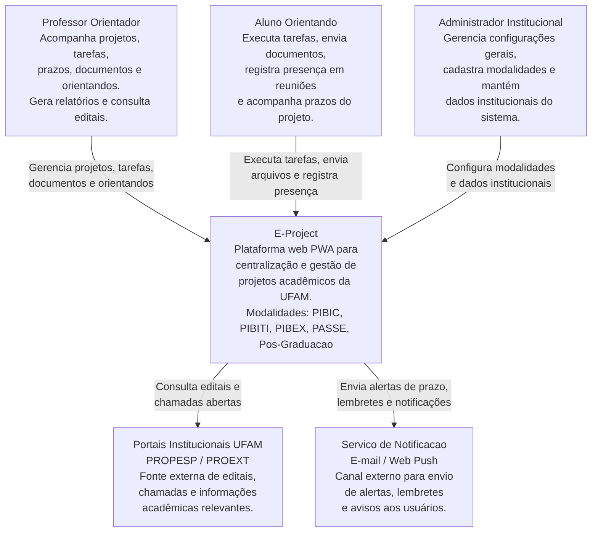
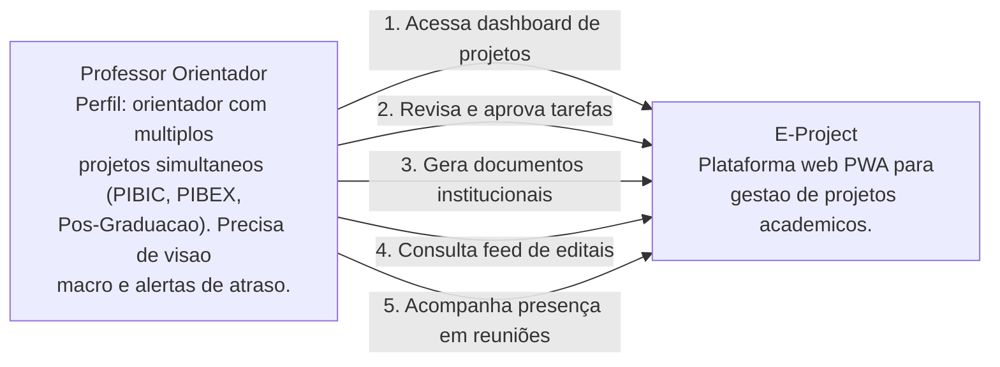
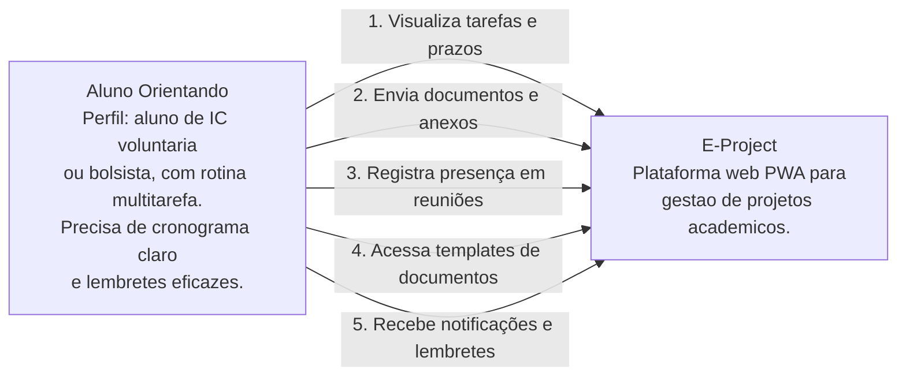
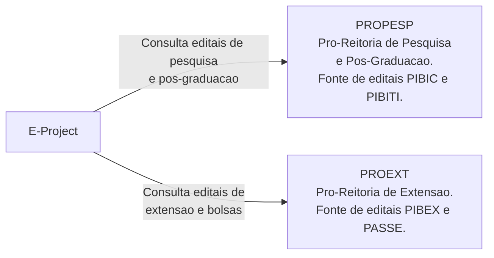
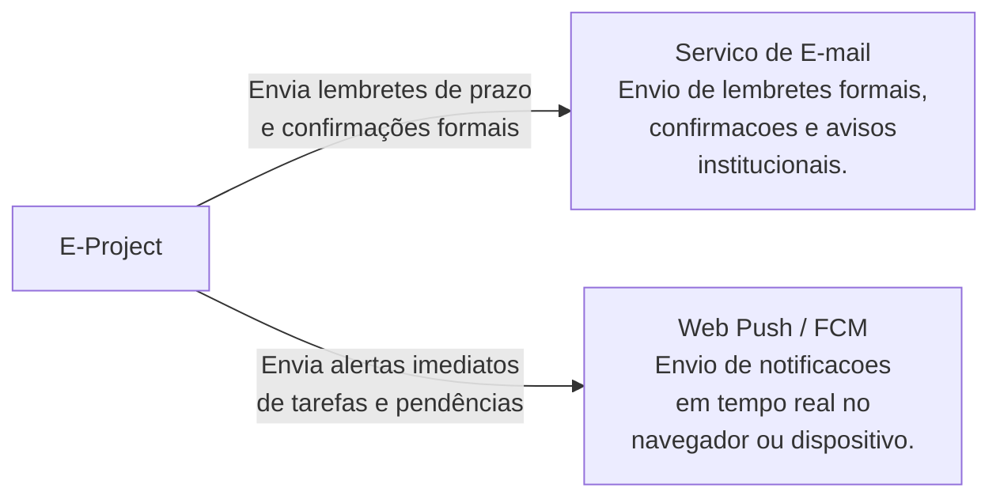
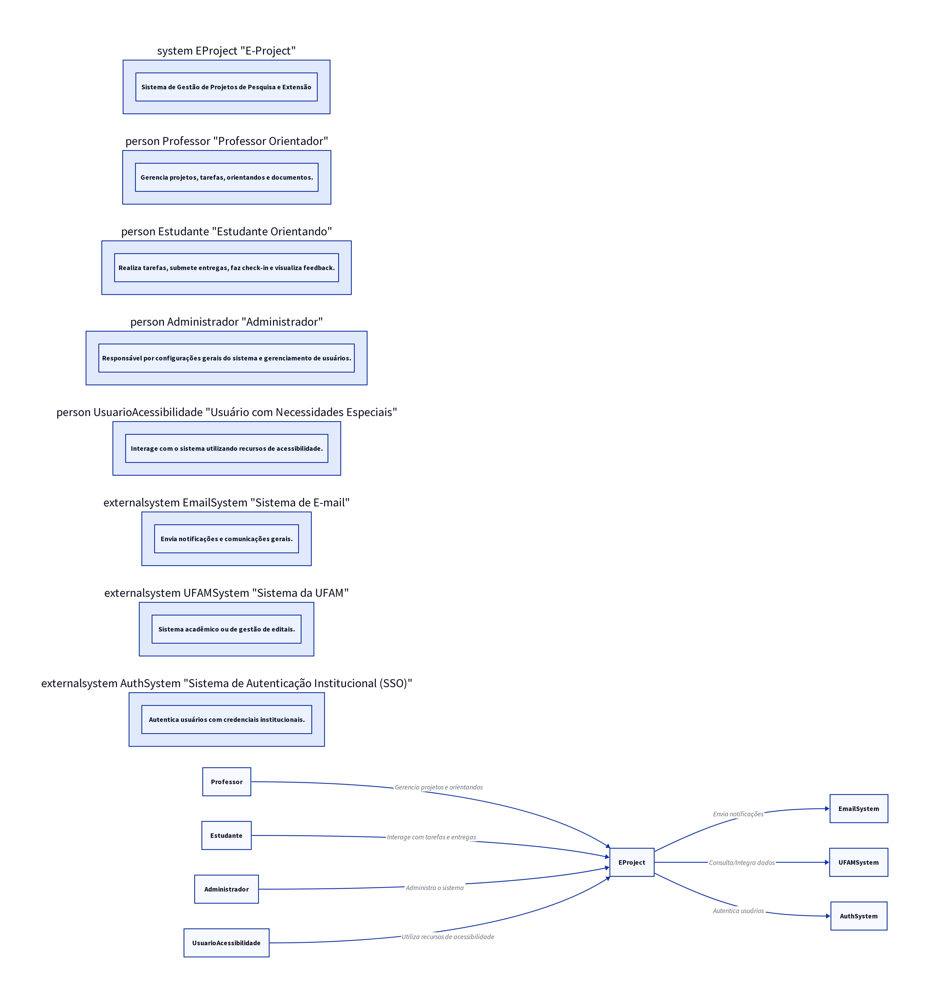

# 3. Diagrama de Contexto — Modelo C4

## 3.1 Visão geral do diagrama

O **Diagrama de Contexto** é o primeiro e mais alto nível do modelo C4. Ele representa o sistema como uma única "caixa preta" e tem como objetivo mostrar **quem interage com o sistema** (atores/usuários) e **quais sistemas externos** se relacionam com ele.

Neste nível, não há preocupação com a estrutura interna do E-Project. O foco está em delimitar as fronteiras do sistema, identificar seus usuários diretos e mapear as dependências externas que são necessárias para seu funcionamento.

---

## 3.2 Explicação geral do diagrama modelado para o sistema

O **E-Project** é uma plataforma web PWA voltada à gestão de projetos acadêmicos da UFAM. No diagrama de contexto, ele aparece como o sistema central, conectado a três grupos de atores e dois sistemas externos.

**Atores que interagem diretamente com o sistema:**

- **Professor Orientador:** utiliza o sistema para acompanhar projetos, revisar tarefas, monitorar prazos, gerar documentos e consultar editais;
- **Aluno Orientando:** utiliza o sistema para visualizar tarefas, enviar entregas, registrar presença em reuniões e acompanhar o andamento do projeto;
- **Administrador Institucional (perfil de suporte):** responsável por configurações gerais, cadastro de modalidades e manutenção de dados institucionais.

**Sistemas externos com os quais o E-Project se integra:**

- **Portais institucionais da UFAM / Pró-Reitorias (PROPESP, PROEXT):** fonte de consulta para editais, chamadas e informações acadêmicas relevantes. O E-Project consome essas informações para alimentar o feed unificado de editais;
- **Serviço de Notificação (E-mail / Web Push):** canal externo utilizado para envio de alertas, lembretes de prazo, avisos de novas tarefas e confirmações de ações importantes.

O diagrama evidencia que o E-Project atua como um **hub centralizador** no ecossistema acadêmico da UFAM, eliminando a necessidade de os usuários acessarem múltiplos sistemas e ferramentas genéricas.

---

## 3.3 Diagrama de Contexto — Visão Completa

**Figura 1 — Diagrama de Contexto do E-Project. Representa os três perfis de usuários que interagem com o sistema e os dois sistemas externos integrados.**

---

## 3.4 Detalhamento por Partes

### Parte 1 — Professor Orientador e E-Project

O professor é o principal usuário do sistema. Ele interage com o E-Project para obter uma visão centralizada de todos os seus projetos acadêmicos, acompanhar o progresso dos orientandos, revisar e aprovar entregas, monitorar prazos e gerar documentos institucionais automaticamente.

**Figura 2 — Interações do Professor Orientador com o E-Project.**

---

### Parte 2 — Aluno Orientando e E-Project

O aluno utiliza o sistema para acompanhar suas responsabilidades dentro do projeto, receber notificações, enviar entregas e registrar presença em reuniões de orientação.

**Figura 3 — Interações do Aluno Orientando com o E-Project.**

---

### Parte 3 — E-Project e Portais Institucionais da UFAM

O E-Project consulta periodicamente os portais das pró-reitorias da UFAM para centralizar editais e chamadas abertas, eliminando a necessidade de os usuários acessarem múltiplos sites diariamente.

**Figura 4 — Integração do E-Project com os portais institucionais da UFAM para alimentação do feed de editais.**

---

### Parte 4 — E-Project e Serviço de Notificação

O sistema utiliza um serviço externo de notificação para enviar alertas e lembretes aos usuários, garantindo que prazos e pendências não sejam esquecidos.

**Figura 5 — Integração do E-Project com os canais de notificação externos.**

---

## 3.5 Considerações Finais

O diagrama de contexto evidencia que o E-Project atua como um sistema centralizador no ambiente acadêmico da UFAM. Ele conecta professores, alunos e administradores a funcionalidades que antes estavam dispersas em ferramentas genéricas como Trello, Notion e Excel, além de eliminar a necessidade de consulta diária a múltiplos portais institucionais.
[1] System context diagram | C4 model. Disponível em: [https://c4model.com/diagrams/system-context](https://c4model.com/diagrams/system-context)

**Legenda:** Diagrama de Contexto do E-Project, mostrando as interações com atores e sistemas externos.
