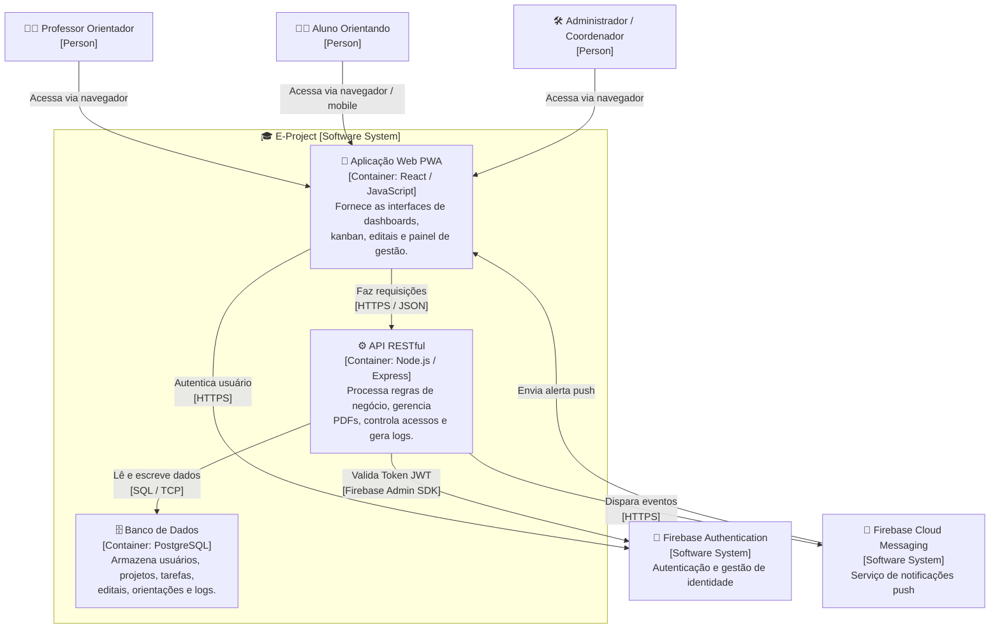
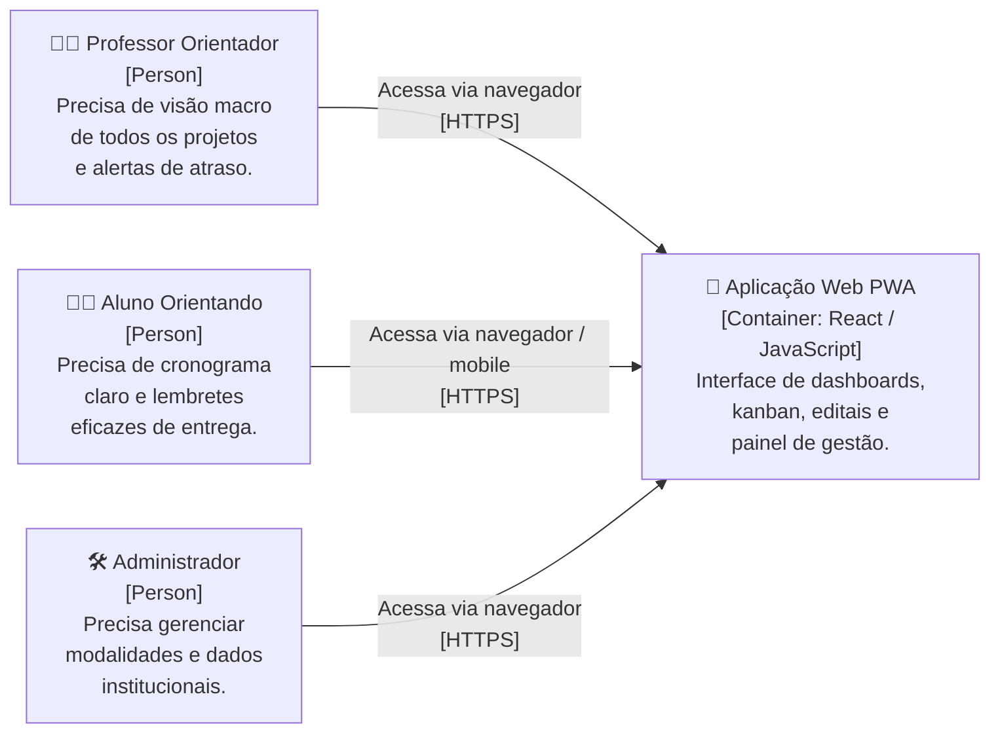
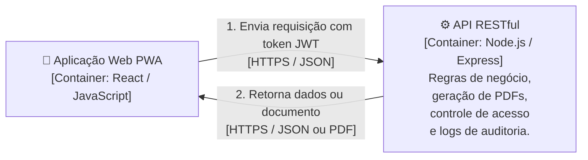
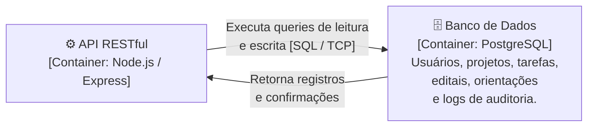
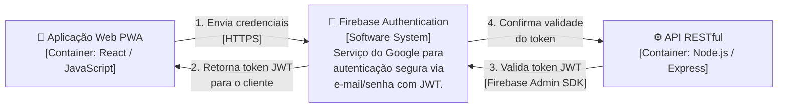
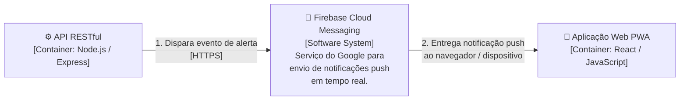

# Diagrama de Containers

**E-Project** · C4 Model · Nível 2

---

## 4.1 Visão Geral do Diagrama

O **Diagrama de Containers** representa o Nível 2 do modelo C4. Ele tem a função de "abrir a caixa preta" do sistema E-Project apresentada no Nível 1 (Contexto), revelando os principais blocos de execução (containers) que compõem a arquitetura da solução.

Neste nível, detalhamos a arquitetura técnica, mostrando as responsabilidades de cada aplicação, banco de dados e as tecnologias envolvidas nas comunicações internas (APIs, conexões de banco) e externas (integrações com Firebase). Um **container**, no contexto do modelo C4, representa qualquer unidade de software implantável ou executável de forma independente — seja uma aplicação web, uma API, um banco de dados ou um processo em background.

---

## 4.2 Explicação Geral do Diagrama Modelado para o Sistema

O sistema E-Project foi desenhado com uma arquitetura baseada na separação de responsabilidades entre cliente, servidor e persistência de dados. Ele é composto por três containers principais, cada um com papel bem delimitado no ecossistema da plataforma.

O fluxo principal de comunicação ocorre via chamadas `HTTP/REST` no formato JSON do Frontend para a API. A API, por sua vez, interage com o banco de dados via `SQL` (por meio de um ORM) e com os serviços externos para validação de tokens JWT e disparo de eventos de notificação.

### 📦 Containers Internos do Sistema

| Container | Tecnologia Base | Responsabilidade |
|-----------|-----------------|------------------|
| **Aplicação Web (PWA)** | React, Tailwind, Recharts | Fornece a interface com o usuário, dashboards visuais (gráficos) para professores e administradores, kanban de tarefas e garante usabilidade offline |
| **API RESTful (Backend)** | Node.js, Express, PDFKit, Winston | Centraliza as regras de negócio, gerencia autorizações, gera documentos oficiais em PDF dinamicamente e audita logs de segurança |
| **Banco de Dados** | PostgreSQL | Armazena de forma estruturada e relacional os dados dos usuários, projetos, tarefas, editais e logs de auditoria |

### 🔌 Sistemas Externos Integrados

| Sistema | Papel no Nível 2 |
|---------|-----------------|
| **Firebase Authentication** | A PWA autentica o usuário via HTTPS; a API valida o token JWT recebido usando o Firebase Admin SDK |
| **Firebase Cloud Messaging (FCM)** | A API dispara eventos de notificação via HTTPS; o FCM entrega alertas push diretamente à PWA no navegador ou dispositivo |

O diagrama evidencia uma arquitetura de **três camadas** (apresentação, lógica e dados), com as integrações externas concentradas na camada de API, exceto o handshake inicial de autenticação, que é iniciado diretamente pelo frontend.

> ⚠️ **Nota sobre MVP:** Neste nível, a comunicação entre containers é representada em sua forma mais direta. Otimizações de performance como cache distribuído (Redis) ou filas de mensagens (Bull/RabbitMQ) são melhorias previstas para fases posteriores ao MVP.

---

## 4.3 Diagrama de Containers — Visão Completa

**Figura 6 —** Diagrama de Containers do E-Project. Representa os três containers internos da plataforma (PWA, API RESTful e Banco de Dados), os três perfis de usuários e os dois sistemas externos integrados (Firebase Authentication e Firebase Cloud Messaging).

---

## 4.4 Detalhamento por Partes

### Parte 1 — Usuários e Aplicação Web (PWA)

A Aplicação Web é o único ponto de entrada dos usuários no sistema. Desenvolvida como uma **Progressive Web App (PWA)** em React, ela é acessível via navegador em desktops e dispositivos móveis, sem necessidade de instalação nativa. O uso do Tailwind CSS garante uma interface responsiva e consistente, enquanto a biblioteca Recharts alimenta os dashboards visuais de progresso disponíveis para professores e administradores.

**Figura 7 —** Acesso dos três perfis de usuário à Aplicação Web PWA do E-Project.

---

### Parte 2 — Aplicação Web (PWA) e API RESTful

A comunicação entre o frontend e o backend é feita exclusivamente via chamadas **HTTPS com payload JSON**, seguindo os princípios REST. A API RESTful, construída em Node.js com Express, é responsável por receber as requisições da PWA, aplicar as regras de negócio, verificar as permissões do usuário com base no token JWT e orquestrar as operações de leitura e escrita no banco de dados.

Além disso, a API utiliza a biblioteca **PDFKit** para gerar documentos institucionais (relatórios, atas de reunião, fichas de projeto) dinamicamente, sem dependência de templates externos. O módulo **Winston** garante o registro estruturado de logs de auditoria para rastreabilidade de ações sensíveis.

**Figura 8 —** Comunicação entre a Aplicação Web e a API RESTful do E-Project.

---

### Parte 3 — API RESTful e Banco de Dados

A API se comunica com o banco de dados **PostgreSQL** via conexão TCP utilizando um ORM (Object-Relational Mapper), que abstrai as queries SQL e facilita a manutenção do esquema de dados. O PostgreSQL foi escolhido por sua robustez em cenários relacionais complexos — necessários para modelar a hierarquia de projetos, tarefas, orientandos, editais e logs de auditoria que o E-Project requer.

**Figura 9 —** Comunicação entre a API RESTful e o Banco de Dados PostgreSQL.

---

### Parte 4 — Containers e Firebase Authentication

A autenticação no E-Project ocorre em dois momentos distintos. Primeiro, a **PWA** envia as credenciais do usuário diretamente ao Firebase Authentication via HTTPS e recebe um token JWT em resposta. Esse token é armazenado no cliente e enviado no cabeçalho de todas as requisições subsequentes à API. Segundo, a **API** valida o token recebido utilizando o **Firebase Admin SDK**, garantindo que nenhuma requisição não autenticada acesse as rotas protegidas.

**Figura 10 —** Fluxo de autenticação envolvendo a PWA, a API e o Firebase Authentication.

---

### Parte 5 — API RESTful, FCM e Aplicação Web (PWA)

O sistema de notificações segue um fluxo de três etapas. A **API** identifica um evento relevante (prazo iminente, nova tarefa atribuída, atualização de status) e dispara uma mensagem via HTTPS ao **Firebase Cloud Messaging**. O FCM processa o evento e entrega a notificação push diretamente ao navegador ou dispositivo do usuário, onde a **PWA** já registrou um Service Worker capaz de receber e exibir alertas mesmo com o aplicativo fechado.

**Figura 11 —** Fluxo de notificações push entre a API, o FCM e a Aplicação Web PWA.

---

## 4.5 Considerações Finais

O Diagrama de Containers evidencia que o E-Project adota uma arquitetura de **três camadas** clara e desacoplada: uma camada de apresentação (PWA React), uma camada de lógica de negócio (API Node.js/Express) e uma camada de persistência (PostgreSQL). Essa separação facilita a manutenção independente de cada componente, permite escalabilidade horizontal da API e garante que alterações no banco de dados não impactem diretamente a experiência do usuário.

As integrações externas do MVP limitam-se ao ecossistema Firebase — **Authentication** para controle de acesso seguro e **FCM** para comunicação proativa com os usuários — mantendo a arquitetura simples, coesa e alinhada com o tech stack definido pela equipe. A escolha do PostgreSQL reforça o compromisso com integridade referencial dos dados em um domínio com relacionamentos complexos, como projetos acadêmicos multi-orientandos e editais com múltiplas modalidades.

> 🔜 **Próximo nível:** O Diagrama de Componentes (Nível 3) detalha a estrutura interna de cada container, revelando os módulos, serviços e repositórios que compõem a API RESTful e a Aplicação Web PWA.

---

**Universidade Federal do Amazonas — ICET | Engenharia de Software I | 2026**

