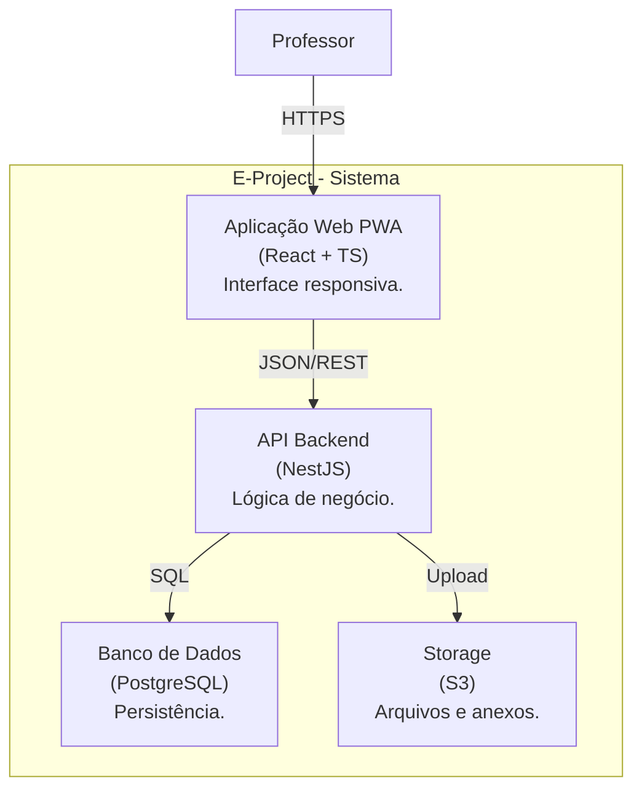
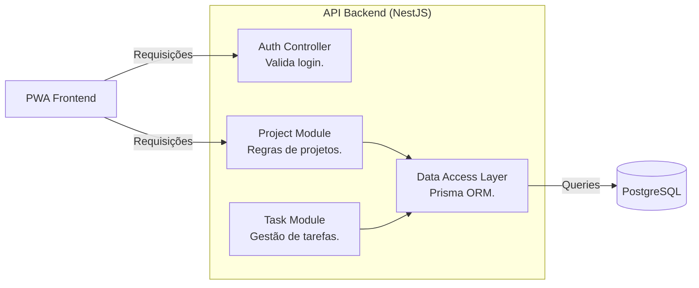

# 4. Diagrama de Containers — Modelo C4

## 4.1 Visão geral do diagrama
O **Diagrama de Containers** detalha os blocos de execução do sistema, mostrando como o E-Project é dividido em unidades independentes de implantação (Web App, API, Banco de Dados).

## 4.2 Explicação geral do diagrama
O sistema é composto por uma aplicação PWA em React, uma API robusta em NestJS/Node.js, um banco de dados PostgreSQL para dados estruturados e um Storage para arquivos de relatórios.

## 4.3 Diagrama de Containers — Visão Completa


**Figura 1 — Diagrama de Containers do E-Project.**

---

### Arquivo: `5-c4-componentes.md`

````markdown
# 5. Diagrama de Componentes — Modelo C4

## 5.1 Visão geral do diagrama
O **Diagrama de Componentes** foca dentro de um container específico. Aqui, detalhamos a **API Backend**, mostrando como seus módulos internos estão organizados.

## 5.2 Explicação geral do diagrama
A API segue a arquitetura modular do NestJS, separando as responsabilidades em controladores de rota, serviços de lógica e repositórios de acesso a dados.

## 5.3 Diagrama de Componentes (API Backend)


**Figura 1 — Componentes internos da API Backend.**
