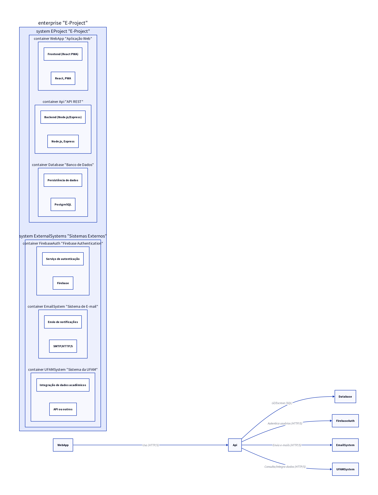

# 4. C4: Containers

## 4.1. Definição Geral do Diagrama de Containers

O **Diagrama de Containers**, o segundo nível do Modelo C4, detalha a arquitetura de um sistema de software, apresentando os principais blocos de construção (*containers*) que o compõem [1]. Um *container* é uma aplicação ou um armazenamento de dados (como um banco de dados) que pode ser executado de forma independente. Este diagrama foca em como esses *containers* se comunicam entre si e com os sistemas externos identificados no Diagrama de Contexto, auxiliando na compreensão da distribuição de responsabilidades e das tecnologias empregadas.

## 4.2. Containers do E-Project

O E-Project será composto pelos seguintes *containers*:

*   **Aplicação Web (PWA):** O *frontend* do sistema, acessível via navegador web e instalável como PWA. Desenvolvido em React, é responsável por toda a interação com o usuário.
    *   **Linguagem/Tecnologia:** JavaScript/TypeScript (React)
    *   **Protocolo de Comunicação:** HTTP/S (API REST)
    *   **Dependências:** API REST do Backend

*   **API REST (Backend):** O *backend* do sistema, que expõe uma API RESTful para a Aplicação Web e outros possíveis clientes. Desenvolvido em Node.js/Express, contém a lógica de negócio e orquestra as operações.
    *   **Linguagem/Tecnologia:** JavaScript/TypeScript (Node.js/Express)
    *   **Protocolo de Comunicação:** HTTP/S
    *   **Dependências:** Banco de Dados PostgreSQL, Firebase Authentication, Sistema de E-mail, Sistema da UFAM

*   **Banco de Dados (PostgreSQL):** O sistema de persistência de dados do E-Project. Armazena todas as informações relacionadas a usuários, projetos, tarefas, documentos, etc.
    *   **Linguagem/Tecnologia:** PostgreSQL
    *   **Protocolo de Comunicação:** Protocolo de banco de dados (e.g., TCP/IP)
    *   **Dependências:** Nenhuma (servido pela API REST)

*   **Firebase Authentication:** Serviço externo de autenticação utilizado para gerenciar o *login* e as sessões dos usuários.
    *   **Linguagem/Tecnologia:** Serviço SaaS (Firebase)
    *   **Protocolo de Comunicação:** HTTP/S (APIs do Firebase)
    *   **Dependências:** Nenhuma (servido pela API REST)

*   **Sistema de E-mail:** Serviço externo para envio de notificações e comunicações por e-mail.
    *   **Linguagem/Tecnologia:** Serviço externo (e.g., SendGrid, Mailgun)
    *   **Protocolo de Comunicação:** SMTP/HTTP/S
    *   **Dependências:** Nenhuma (servido pela API REST)

*   **Sistema da UFAM:** Sistema externo para integração de dados acadêmicos ou de editais.
    *   **Linguagem/Tecnologia:** Variável (depende do sistema da UFAM)
    *   **Protocolo de Comunicação:** HTTP/S (API ou outros)
    *   **Dependências:** Nenhuma (servido pela API REST)

## 4.4. Explicação Global do Diagrama

O Diagrama de Containers do E-Project detalha como o sistema é dividido em unidades implantáveis e independentes. A **Aplicação Web (PWA)**, a **API REST (Backend)** e o **Banco de Dados (PostgreSQL)** são os *containers* principais do sistema. Eles interagem com serviços externos como **Firebase Authentication**, **Sistema de E-mail** e **Sistema da UFAM** para funcionalidades específicas. Este diagrama ilustra as principais tecnologias e os protocolos de comunicação entre esses *containers*.

### Detalhamento por Partes

*   **Aplicação Web (PWA):** O ponto de entrada para os usuários, executado no navegador ou como um aplicativo instalado. Comunica-se com a API REST para todas as operações de dados e lógica de negócio.
*   **API REST (Backend):** O coração da lógica de negócio, recebendo requisições da Aplicação Web, processando-as, interagindo com o banco de dados e serviços externos, e retornando as respostas.
*   **Banco de Dados (PostgreSQL):** O repositório central de dados, acessado exclusivamente pela API REST.
*   **Firebase Authentication:** Fornece serviços de autenticação para a API REST, que, por sua vez, gerencia as sessões dos usuários.
*   **Sistema de E-mail:** Utilizado pela API REST para enviar notificações transacionais e informativas aos usuários.
*   **Sistema da UFAM:** A API REST pode se integrar a este sistema para buscar ou enviar dados relevantes, como informações de matrícula ou editais.

## Referências
[1] Container diagram - C4 model. Disponível em: [https://c4model.com/diagrams/container](https://c4model.com/diagrams/container)

**Legenda:** Diagrama de Containers do E-Project, mostrando os principais blocos de construção e suas interações.
