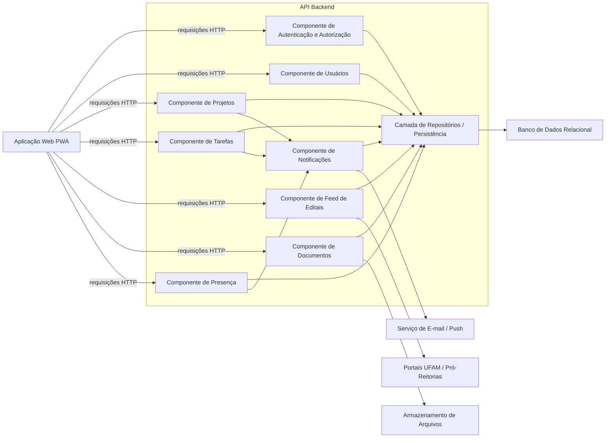
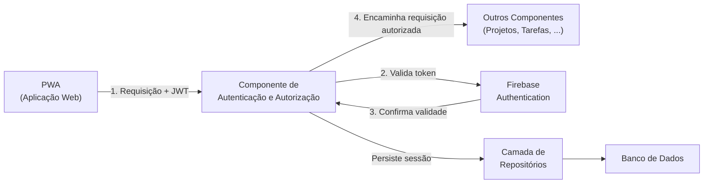
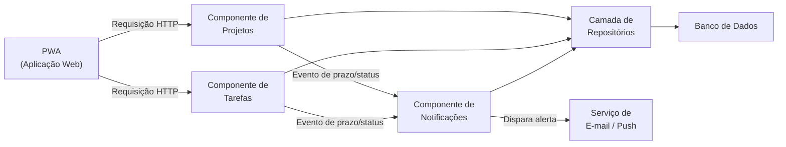
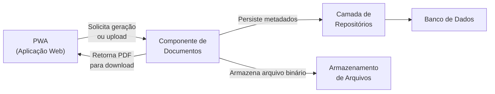
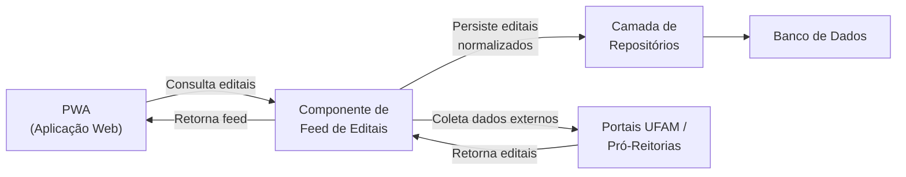
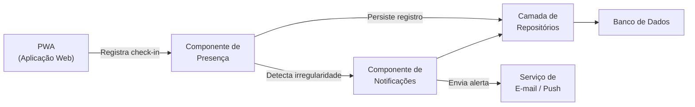

# Diagrama de Componentes

**E-Project** · C4 Model · Nível 3

---

---

## 5.1 Visão Geral do Diagrama

O **Diagrama de Componentes** representa o Nível 3 do modelo C4. Ele tem a função de "abrir a caixa preta" do container **API REST (Backend)** apresentado no Nível 2 (Containers), revelando os módulos internos que compõem a lógica do sistema.

Neste nível, cada **componente** representa um agrupamento de funcionalidades relacionadas que reside dentro de um container. Um componente é a menor unidade arquitetural com identidade própria dentro do sistema — podendo corresponder a um conjunto de classes, um serviço, um repositório, um adaptador ou um controlador de API.

O objetivo deste diagrama é mostrar:

- **Quais componentes existem** dentro da API Backend;
- **Qual a responsabilidade** de cada componente;
- **Como os componentes se comunicam** entre si e com recursos externos;
- **Como os componentes se alinham** às funcionalidades do backlog do E-Project.

---

## 5.2 Explicação Geral do Diagrama

O E-Project organiza a lógica interna da **API REST (Backend)** em oito componentes de negócio, uma camada de repositórios e integrações com sistemas externos. Essa separação segue os princípios da **Arquitetura em Camadas** e do padrão **MVC**, garantindo que cada parte do sistema tenha responsabilidade única e bem delimitada.

O fluxo principal começa na **Aplicação Web PWA**, que envia requisições HTTP para os componentes da API. Cada componente de negócio processa a lógica de sua área — autenticação, usuários, projetos, tarefas, editais, documentos, presença e notificações — e acessa dados por meio da **Camada de Repositórios**, que centraliza a comunicação com o **Banco de Dados Relacional**. Componentes com responsabilidades específicas de integração acessam diretamente serviços externos, como o **Armazenamento de Arquivos**, os **Portais UFAM** e o **Serviço de E-mail/Push**.

A separação em componentes funcionais é motivada por três razões centrais:

1. **Coesão:** cada componente agrupa apenas funcionalidades relacionadas ao seu domínio.
2. **Baixo acoplamento:** os componentes se comunicam de forma controlada, sem dependências cruzadas desnecessárias.
3. **Rastreabilidade:** cada componente pode ser diretamente mapeado para histórias de usuário específicas do backlog.

---

## 5.3 Diagrama de Componentes da API Backend

**Figura 1 — Diagrama de Componentes da API Backend do E-Project, evidenciando os principais módulos de negócio, suas dependências internas e integrações com sistemas externos.**

---

## 5.4 Descrição dos Componentes

### Componente de Autenticação e Autorização

Responsável por autenticar usuários, gerenciar sessões e controlar as permissões de acesso por perfil (Professor, Aluno, Administrador). Valida tokens JWT emitidos pelo Firebase Authentication e intercepta requisições não autorizadas antes de encaminhá-las aos demais componentes. É o ponto de entrada obrigatório para todas as operações protegidas da API.

---

### Componente de Usuários

Gerencia o ciclo de vida dos usuários no sistema: cadastro, atualização de perfil, ativação, inativação e consulta de dados de professores e alunos. Permite ao Administrador realizar operações de gestão de contas e definição de permissões por meio do Firebase Admin SDK. Armazena e recupera dados via Camada de Repositórios.

---

### Componente de Projetos

Controla o cadastro, o acompanhamento, a atualização e a encerramento de projetos acadêmicos. Suporta múltiplas modalidades (PIBIC, PIBITI, PIBEX, PACE, Pós-Graduação), gerencia o cronograma do projeto e acompanha o progresso geral. É responsável por acionar o Componente de Notificações quando há alterações relevantes de status ou prazo.

---

### Componente de Tarefas

Gerencia a criação, a atribuição, a atualização de status e o acompanhamento das tarefas vinculadas aos projetos. Suporta o fluxo Kanban (A Fazer → Em Andamento → Concluído) e aciona notificações quando tarefas são criadas, atualizadas ou quando seus prazos se aproximam.

---

### Componente de Feed de Editais

Consulta fontes externas — como os Portais das Pró-Reitorias da UFAM — e organiza os editais em um feed centralizado acessível a todos os usuários da plataforma. Permite que o Administrador cadastre editais manualmente e gerencia os metadados de cada oportunidade publicada.

---

### Componente de Documentos

Responsável pela geração automática de documentos institucionais (relatórios parciais, declarações de bolsista, atas de reunião) utilizando a biblioteca PDFKit, além de gerenciar uploads, anexos e organização de arquivos vinculados aos projetos. Os metadados são persistidos via Camada de Repositórios, enquanto os arquivos binários são armazenados no serviço de Armazenamento de Arquivos.

---

### Componente de Presença

Registra check-ins e controla a presença dos alunos em reuniões de orientação e atividades vinculadas ao projeto. Provê histórico de frequência para professores e administradores e aciona o Componente de Notificações quando há ausências ou irregularidades detectadas.

---

### Componente de Notificações

Orquestra o disparo de alertas e notificações relacionados a prazos iminentes, novas tarefas, atualizações de status de projetos, editais publicados e registros de presença. Utiliza o Firebase Cloud Messaging (FCM) para entrega de notificações push e o serviço de e-mail para alertas formais. É acionado pelos componentes de Projetos, Tarefas e Presença.

---

### Camada de Repositórios / Persistência

Faz a mediação entre todos os componentes de negócio e o banco de dados PostgreSQL, utilizando o Prisma ORM para abstração das operações de leitura e escrita. Garante tipagem segura em TypeScript e centraliza a lógica de acesso a dados, impedindo que os componentes de negócio dependam diretamente da implementação do banco.

---

## 5.5 Detalhamento por Partes

### Parte 1 — Fluxo de Autenticação e Controle de Acesso

O Componente de Autenticação e Autorização é o interceptador de todas as requisições recebidas pela API. Quando a PWA envia uma requisição com um token JWT no cabeçalho, este componente valida o token junto ao Firebase Admin SDK antes de permitir o acesso ao componente de destino. Caso o token seja inválido ou ausente, a requisição é rejeitada imediatamente.

**Figura 2 — Fluxo de autenticação e autorização no E-Project: o Componente de Autenticação intercepta todas as requisições e valida o token JWT antes de encaminhar ao componente de destino.**

---

### Parte 2 — Fluxo de Gestão de Projetos e Tarefas

O Componente de Projetos e o Componente de Tarefas trabalham em conjunto para suportar o ciclo de vida completo de um projeto acadêmico. Quando um professor cadastra um projeto, o Componente de Projetos persiste os dados e, ao definir tarefas associadas, aciona o Componente de Tarefas. Ambos os componentes disparam notificações via Componente de Notificações quando há eventos relevantes.

**Figura 3 — Fluxo de gestão de projetos e tarefas: os dois componentes persistem dados via repositório e acionam notificações para eventos relevantes.**

---

### Parte 3 — Fluxo de Documentos

O Componente de Documentos é responsável por dois fluxos distintos: a **geração automática** de documentos PDF (via PDFKit) e o **armazenamento de arquivos** enviados pelos usuários. Ao gerar um documento, os metadados são persistidos via Camada de Repositórios no banco de dados, enquanto o arquivo binário é enviado ao Armazenamento de Arquivos. O arquivo gerado é então disponibilizado ao usuário para download direto.

**Figura 4 — Fluxo de documentos: o componente persiste metadados no banco e arquiva binários no serviço de armazenamento, entregando o PDF ao usuário.**

---

### Parte 4 — Fluxo de Feed de Editais

O Componente de Feed de Editais consulta periodicamente os Portais das Pró-Reitorias da UFAM para coletar novos editais e disponibilizá-los de forma centralizada na plataforma. Os dados coletados são normalizados e persistidos via Camada de Repositórios, tornando-os acessíveis para todos os perfis de usuários.

**Figura 5 — Fluxo de editais: o componente coleta dados dos portais externos da UFAM, normaliza e persiste as informações no banco de dados.**

---

### Parte 5 — Fluxo de Presença e Notificações

O Componente de Presença registra os check-ins de alunos em reuniões e atividades acadêmicas. Após cada registro, verifica automaticamente se há irregularidades de frequência e, em caso positivo, aciona o Componente de Notificações, que entrega o alerta ao professor e ao aluno por push ou e-mail.

**Figura 6 — Fluxo de presença: após cada registro, o componente avalia irregularidades e aciona notificações quando necessário.**

---

## 5.6 Alinhamento com o Backlog — Rastreabilidade

A tabela a seguir evidencia como os componentes da API Backend se alinham diretamente às histórias de usuário definidas no backlog do E-Project (TP1):

| Componente | Histórias de Usuário | Descrição do Alinhamento |
|:---|:---|:---|
| **Autenticação e Autorização** | US-01, US-09, US-13 | Suporta login, controle de sessão e gerenciamento de perfis de acesso (Professor, Aluno, Administrador). |
| **Usuários** | US-09, US-13 | Permite ao Administrador cadastrar, ativar, inativar e consultar usuários e seus perfis. |
| **Projetos** | US-02, US-03, US-08 | Suporta criação, acompanhamento, atualização e encerramento de projetos por modalidade. |
| **Tarefas** | US-04, US-06, US-10, US-14 | Gerencia o ciclo de vida das tarefas no fluxo Kanban, incluindo atribuição e controle de prazos. |
| **Feed de Editais** | US-11 | Centraliza e disponibiliza editais coletados dos portais da UFAM para todos os usuários. |
| **Documentos** | US-07 | Gera automaticamente relatórios parciais e declarações de bolsista no padrão institucional. |
| **Presença** | US-06 | Registra check-ins em reuniões de orientação e controla a frequência dos alunos. |
| **Notificações** | US-05, US-12 | Dispara alertas de prazos, atualizações de tarefas, novos editais e irregularidades de presença. |

---

## 5.7 Tabela de Comunicações Internas

| Origem | Destino | Tipo | Descrição |
|:---|:---|:---|:---|
| Aplicação Web (PWA) | Componente de Autenticação | HTTP / JWT | Validação de credenciais e autorização de acesso |
| Aplicação Web (PWA) | Componentes de Negócio | HTTP / JSON | Todas as operações funcionais da plataforma |
| Componentes de Negócio | Camada de Repositórios | Interno (TypeScript) | Leitura e escrita de dados via Prisma ORM |
| Camada de Repositórios | Banco de Dados PostgreSQL | SQL / TCP | Execução de queries e persistência de dados |
| Componente de Documentos | Armazenamento de Arquivos | HTTPS | Upload e recuperação de arquivos binários |
| Componente de Editais | Portais UFAM / Pró-Reitorias | HTTPS / Web Scraping | Coleta de dados de editais externos |
| Componentes de Negócio | Componente de Notificações | Interno (Evento) | Acionamento de alertas por eventos de negócio |
| Componente de Notificações | Serviço de E-mail / Push (FCM) | HTTPS / FCM API | Entrega de notificações push e e-mails |

---

## 5.8 Considerações Finais

O Diagrama de Componentes evidencia como a lógica de negócio do E-Project está distribuída de forma coesa e desacoplada dentro da API Backend. A separação em oito componentes de domínio, combinada com uma Camada de Repositórios centralizada, oferece:

- **Manutenibilidade:** cada componente pode ser modificado de forma independente sem impactar os demais.
- **Testabilidade:** os componentes de negócio podem ser testados isoladamente com mocks da Camada de Repositórios.
- **Rastreabilidade:** cada componente é diretamente mapeável a histórias de usuário concretas do backlog.
- **Escalabilidade:** componentes de alta demanda (como Notificações e Documentos) podem ser extraídos para microsserviços em versões futuras do sistema.

Essa arquitetura reforça a consistência com os padrões definidos nos níveis anteriores do modelo C4 e com os princípios da Arquitetura em Camadas adotada pelo E-Project.

---

**Universidade Federal do Amazonas — ICET | Engenharia de Software I | 2026**

