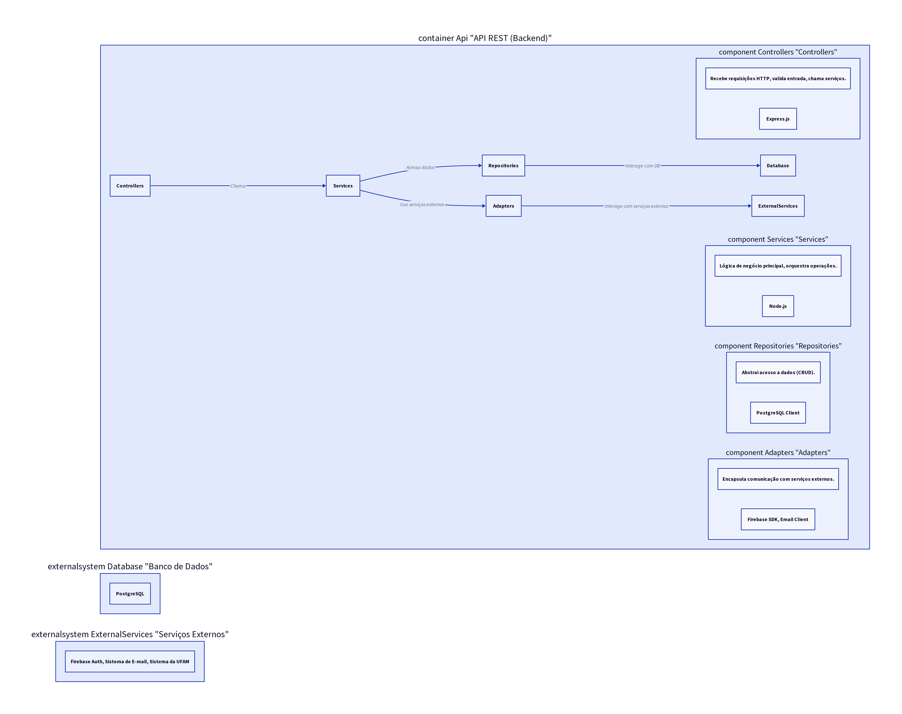

# 5. C4: Componentes

## 5.1. Definição Geral do Diagrama de Componentes

O **Diagrama de Componentes**, o terceiro nível do Modelo C4, detalha a estrutura interna de um *container*, apresentando os componentes que o compõem, suas responsabilidades, interfaces e as tecnologias de implementação [1]. Um componente é um agrupamento de funcionalidades relacionadas que reside dentro de um *container* e é implantável de forma independente. Este diagrama é crucial para desenvolvedores, pois oferece uma visão mais granular da arquitetura, facilitando o entendimento de como as diferentes partes do sistema interagem para entregar funcionalidades específicas.

## 5.2. Detalhamento dos Módulos Internos da API (Backend)

Focando no *container* **API REST (Backend)**, os seguintes módulos internos (componentes) são previstos para organizar a lógica de negócio e a interação com o banco de dados e serviços externos:

*   **Controllers:** Responsáveis por receber as requisições HTTP, validar os dados de entrada, chamar os serviços apropriados e formatar a resposta HTTP. Atuam como a camada de entrada da API.
*   **Services:** Contêm a lógica de negócio principal da aplicação. Orquestram as operações, interagem com os repositórios para acesso a dados e podem se comunicar com adaptadores para serviços externos. São a camada onde as regras de negócio são aplicadas.
*   **Repositories:** Abstraem a lógica de acesso a dados, fornecendo uma interface para que os serviços possam interagir com o banco de dados sem conhecer os detalhes de implementação da persistência. Cada repositório é responsável por uma entidade de domínio específica (por exemplo, `UserRepository`, `ProjectRepository`).
*   **Adapters:** Módulos responsáveis por encapsular a comunicação com serviços externos, como o Firebase Authentication, o sistema de e-mail ou o sistema da UFAM. Eles traduzem as chamadas internas da aplicação para o formato exigido pelo serviço externo e vice-versa.

## 5.3. Alinhamento com as Funcionalidades Principais do Backlog

Os componentes da API serão alinhados com as funcionalidades principais do *backlog* do E-Project. Por exemplo:

*   **Gestão de Usuários (US-01, US-09, US-13):** Envolverá `UserController`, `UserService`, `UserRepository` e `FirebaseAdapter`.
*   **Gestão de Projetos (US-02, US-03, US-08):** Envolverá `ProjectController`, `ProjectService`, `ProjectRepository`.
*   **Gestão de Tarefas e Entregas (US-04, US-06, US-10, US-11, US-14):** Envolverá `TaskController`, `TaskService`, `TaskRepository`, `DeliveryController`, `DeliveryService`, `DeliveryRepository`.
*   **Notificações (US-05, US-12):** Envolverá `NotificationService` e `EmailAdapter`.
*   **Geração de Documentos (US-07):** Envolverá `DocumentController`, `DocumentService`.

## 5.5. Explicação Global do Diagrama

O Diagrama de Componentes foca na estrutura interna do *container* **API REST (Backend)**. Ele ilustra como os `Controllers` recebem requisições, os `Services` orquestram a lógica de negócio, os `Repositories` gerenciam o acesso a dados e os `Adapters` lidam com a integração com sistemas externos. Essa separação de responsabilidades promove um código mais limpo, testável e de fácil manutenção.

### Detalhamento por Partes

*   **Controllers:** Ponto de entrada para as requisições HTTP. Cada *controller* agrupa *endpoints* relacionados a uma funcionalidade (por exemplo, `UserController` para operações de usuário).
*   **Services:** Contêm a lógica de negócio e coordenam as operações. Um serviço pode utilizar múltiplos repositórios e adaptadores para completar uma tarefa.
*   **Repositories:** Fornecem métodos para operações CRUD (*Create*, *Read*, *Update*, *Delete*) em entidades de domínio, abstraindo a complexidade do banco de dados.
*   **Adapters:** Permitem que a API se comunique com serviços externos de forma padronizada, isolando a lógica de integração.

## Referências
[1] Component diagram - C4 model. Disponível em: [https://c4model.com/diagrams/component](https://c4model.com/diagrams/component)

**Legenda:** Diagrama de Componentes do E-Project, detalhando a estrutura interna do container API REST.
