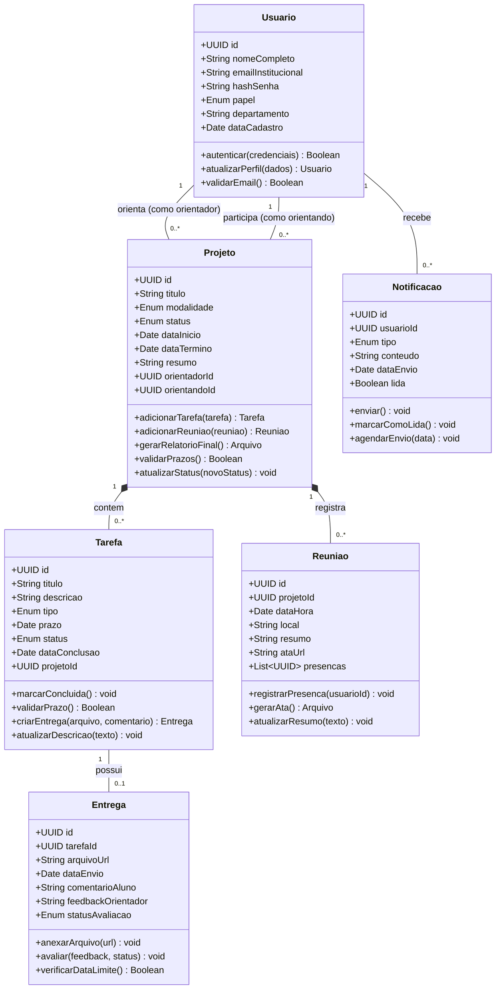
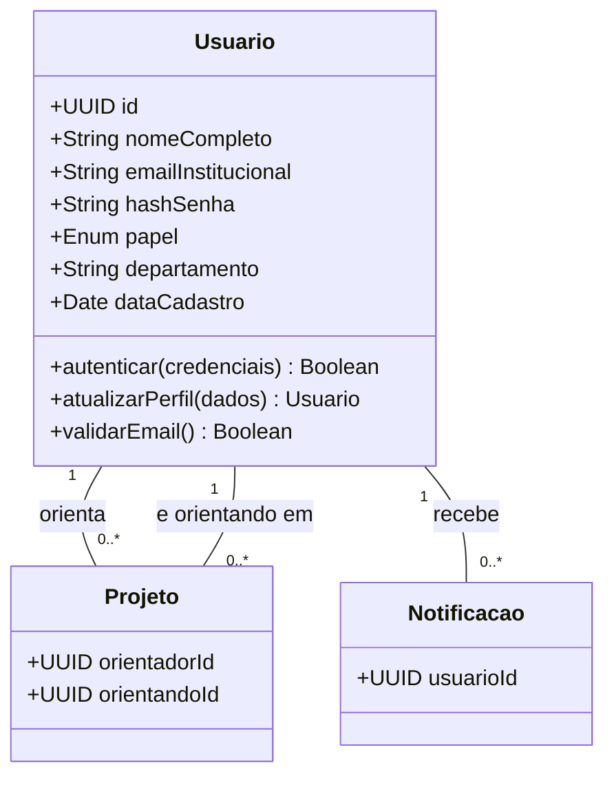
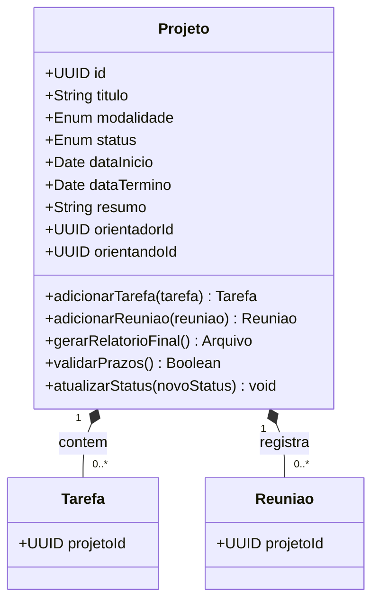
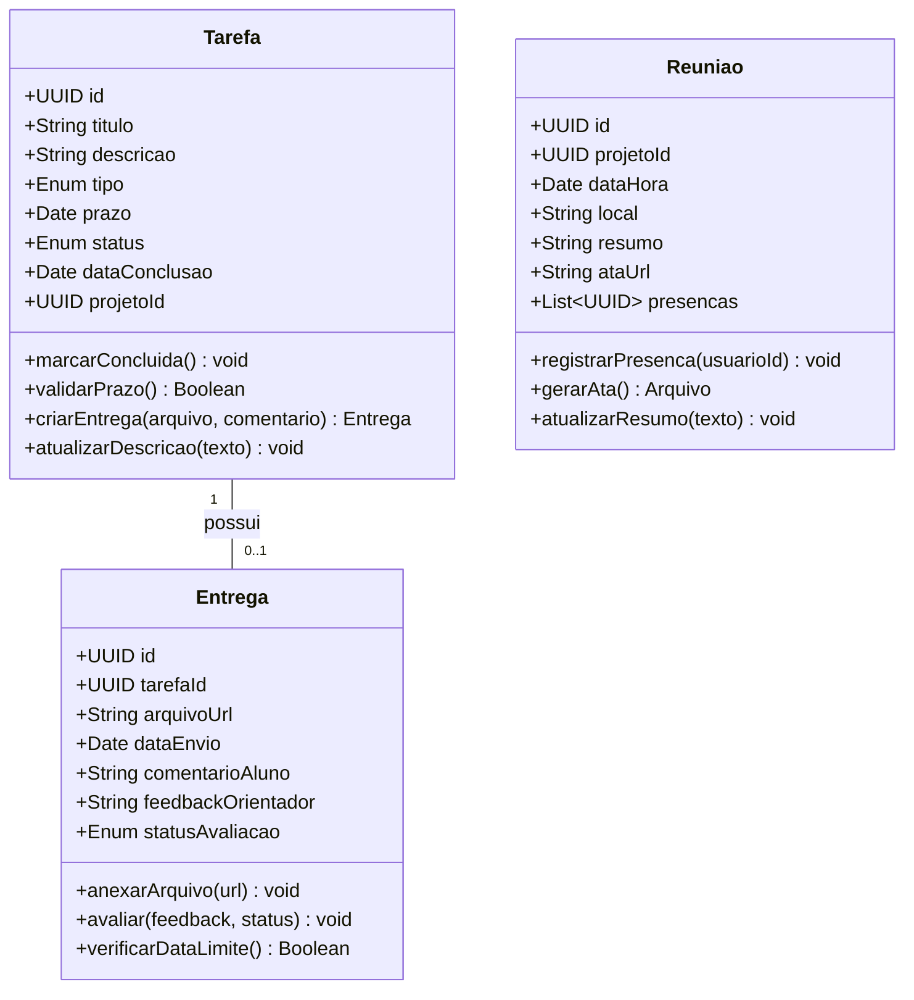
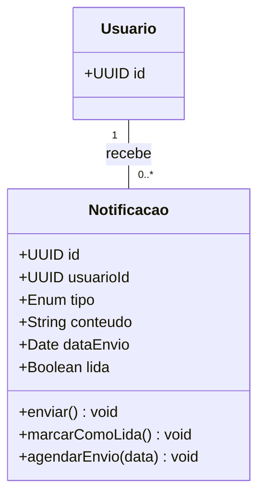

# 6. Diagrama de Código (Classes UML) — Modelo C4

## 6.1 Visão geral do diagrama

O **Diagrama de Código** é o quarto e mais granular nível do modelo C4. Ele desce até o nível da implementação, apresentando a estrutura interna de classes, interfaces, atributos e métodos de um componente específico do sistema.

Este diagrama não visa representar todo o código-fonte do E-Project. Ao invés disso, ele detalha as **classes centrais do domínio de negócio** que sustentam o funcionamento da aplicação, mostrando como os dados são modelados, como as entidades se relacionam e quais operações cada classe executa.

O foco aqui é o **módulo de Gestão de Projetos** da API Backend, pois ele representa o coração do sistema, englobando projetos, tarefas, entregas, reuniões e notificações.

---

---

## 6.4 Detalhamento por Partes
Parte 1 — Classe Usuario (Autenticação e Perfis)
A classe Usuario é a base de todo o controle de acesso. Ela utiliza um campo papel (enum: PROFESSOR, ALUNO, ADMINISTRADOR) para diferenciar permissões sem criar subclasses desnecessárias, mantendo o modelo flexível para futuros perfis institucionais.

**Figura 2 — Classe Usuario e suas associações. Representa a identidade digital dos atores do sistema e sua vinculação com projetos e alertas.**

Explicação dos métodos:
autenticar(): valida credenciais contra o banco de dados, utilizando o hash da senha;
atualizarPerfil(): permite ao usuário modificar dados pessoais e preferências;
validarEmail(): garante que apenas e-mails institucionais da UFAM (@ufam.edu.br) sejam aceitos no cadastro.

---

Parte 2 — Classe Projeto (Núcleo do Domínio)
A classe Projeto é o eixo central do E-Project. Ela agrega todas as informações relativas a uma iniciativa acadêmica e mantém o controle sobre seu ciclo de vida, desde a submissão até a conclusão.

---

**Figura 3 — Classe Projeto como agregadora de Tarefas e Reuniões. Representa o contrato acadêmico entre orientador e orientando.**

Explicação dos métodos:
adicionarTarefa(): cria uma nova tarefa vinculada ao projeto, atualizando automaticamente o cronograma;
adicionarReuniao(): registra um encontro de orientação e o associa ao histórico do projeto;
gerarRelatorioFinal(): consolida dados do projeto, tarefas concluídas e atas de reunião em um documento padronizado;
validarPrazos(): verifica se o projeto está dentro do período de vigência da modalidade acadêmica;
atualizarStatus(): altera o estado do projeto (ex: EM_ANDAMENTO, PENDENTE, CONCLUIDO, CANCELADO).

---

Parte 3 — Classes Tarefa, Entrega e Reuniao (Fluxo Operacional)
Esse conjunto de classes representa o dia a dia da orientação. O aluno recebe tarefas, entrega documentos e participa de reuniões. O professor acompanha tudo por meio dessas entidades.

---

**Figura 4 — Fluxo operacional da orientação: Tarefas geram Entregas e Reuniões registram o acompanhamento presencial/online.**

Explicação das classes e métodos:
Tarefa:

marcarConcluida(): altera o status da tarefa e registra a data de conclusão;
validarPrazo(): compara a data atual com o prazo estipulado, retornando false se houver atraso;
criarEntrega(): instancia um objeto Entrega vinculado a esta tarefa.
Entrega:

anexarArquivo(): recebe a URL do arquivo armazenado no Storage (S3) e a persiste;
avaliar(): permite ao professor registrar feedback e marcar a entrega como APROVADA ou NECESSITA_AJUSTE;
verificarDataLimite(): valida se a entrega foi enviada dentro do prazo da tarefa vinculada.
Reuniao:

registrarPresenca(): adiciona o ID do usuário à lista de presenças, evitando duplicatas;
gerarAta(): produz um documento PDF ou texto com os dados da reunião e lista de presentes;
atualizarResumo(): permite ao orientador descrever o que foi discutido na reunião.

---

Parte 4 — Classe Notificacao (Serviço de Alertas)
A classe Notificacao desacopla o envio de alertas do restante do domínio. Ela é consumida pelo serviço de jobs para enviar comunicações via e-mail ou Web Push.

---

**Figura 5 — Classe Notificacao representando o sistema de alertas e comunicação assíncrona com os usuários.**

Explicação dos métodos:
enviar(): dispara a notificação pelo canal apropriado (e-mail ou push) e registra a data de envio;
marcarComoLida(): atualiza o flag lida para true, removendo o alerta da caixa de entrada do usuário;
agendarEnvio(): permite programar o envio da notificação para uma data futura, útil para lembretes de prazo.
