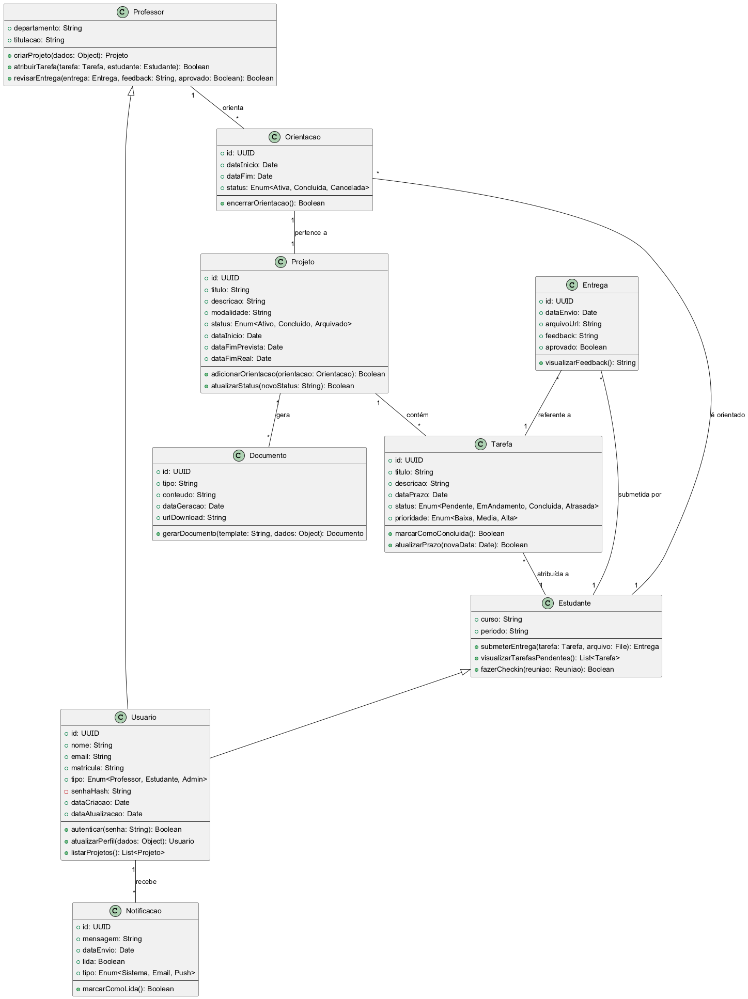

# 6. C4: Código (UML)

## 6.1. Definição Geral do Diagrama de Classes UML

O Diagrama de Classes UML (Unified Modeling Language) é uma representação estática da estrutura de um sistema, mostrando as classes, seus atributos, métodos e os relacionamentos entre elas [1]. É uma ferramenta fundamental para a modelagem orientada a objetos, permitindo que desenvolvedores e arquitetos visualizem a organização do código, identifiquem as principais entidades e compreendam como elas interagem. Este diagrama serve como um blueprint para a implementação do código, garantindo consistência e clareza na estrutura do software.

## 6.2. Mapeamento das Classes Principais do E-Project

Com base nas funcionalidades do E-Project e nas entidades identificadas no backlog, as classes principais e seus elementos são:

### Classes

*   **`Usuario`**
    *   **Atributos:** `id: UUID`, `nome: String`, `email: String`, `matricula: String`, `tipo: Enum<Professor, Estudante, Admin>`, `senhaHash: String`, `dataCriacao: Date`, `dataAtualizacao: Date`
    *   **Métodos:** `autenticar(senha: String): Boolean`, `atualizarPerfil(dados: Object): Usuario`, `listarProjetos(): List<Projeto>`

*   **`Professor`** (Herda de `Usuario`)
    *   **Atributos:** `departamento: String`, `titulacao: String`
    *   **Métodos:** `criarProjeto(dados: Object): Projeto`, `atribuirTarefa(tarefa: Tarefa, estudante: Estudante): Boolean`, `revisarEntrega(entrega: Entrega, feedback: String, aprovado: Boolean): Boolean`

*   **`Estudante`** (Herda de `Usuario`)
    *   **Atributos:** `curso: String`, `periodo: String`
    *   **Métodos:** `submeterEntrega(tarefa: Tarefa, arquivo: File): Entrega`, `visualizarTarefasPendentes(): List<Tarefa>`, `fazerCheckin(reuniao: Reuniao): Boolean`

*   **`Projeto`**
    *   **Atributos:** `id: UUID`, `titulo: String`, `descricao: String`, `modalidade: String`, `status: Enum<Ativo, Concluido, Arquivado>`, `dataInicio: Date`, `dataFimPrevista: Date`, `dataFimReal: Date`
    *   **Métodos:** `adicionarOrientacao(orientacao: Orientacao): Boolean`, `atualizarStatus(novoStatus: String): Boolean`

*   **`Orientacao`**
    *   **Atributos:** `id: UUID`, `dataInicio: Date`, `dataFim: Date`, `status: Enum<Ativa, Concluida, Cancelada>`
    *   **Métodos:** `encerrarOrientacao(): Boolean`

*   **`Tarefa`**
    *   **Atributos:** `id: UUID`, `titulo: String`, `descricao: String`, `dataPrazo: Date`, `status: Enum<Pendente, EmAndamento, Concluida, Atrasada>`, `prioridade: Enum<Baixa, Media, Alta>`
    *   **Métodos:** `marcarComoConcluida(): Boolean`, `atualizarPrazo(novaData: Date): Boolean`

*   **`Entrega`**
    *   **Atributos:** `id: UUID`, `dataEnvio: Date`, `arquivoUrl: String`, `feedback: String`, `aprovado: Boolean`
    *   **Métodos:** `visualizarFeedback(): String`

*   **`Documento`**
    *   **Atributos:** `id: UUID`, `tipo: String`, `conteudo: String`, `dataGeracao: Date`, `urlDownload: String`
    *   **Métodos:** `gerarDocumento(template: String, dados: Object): Documento`

*   **`Notificacao`**
    *   **Atributos:** `id: UUID`, `mensagem: String`, `dataEnvio: Date`, `lida: Boolean`, `tipo: Enum<Sistema, Email, Push>`
    *   **Métodos:** `marcarComoLida(): Boolean`

## 6.3. Definição de Atributos, Métodos e Relações

### Relações

*   **Herança:** `Professor` e `Estudante` herdam de `Usuario`.
*   **Associação:**
    *   Um `Professor` pode ter múltiplas `Orientacao`s.
    *   Um `Estudante` pode ter múltiplas `Orientacao`s.
    *   Uma `Orientacao` associa um `Professor` a um `Estudante` em um `Projeto`.
    *   Um `Projeto` pode ter múltiplas `Orientacao`s.
    *   Um `Projeto` pode ter múltiplas `Tarefa`s.
    *   Uma `Tarefa` pertence a um `Projeto` e é atribuída a um `Estudante`.
    *   Uma `Entrega` está associada a uma `Tarefa` e a um `Estudante`.
    *   Um `Usuario` pode receber múltiplas `Notificacao`s.
    *   Um `Projeto` pode gerar múltiplos `Documento`s.

## 6.4. Diagrama de Classes Completo

[Será inserido o diagrama D2 aqui]

## 6.5. Explicação do Diagrama

O Diagrama de Classes UML do E-Project apresenta as principais entidades do sistema e como elas se relacionam. A classe `Usuario` é a base para `Professor` e `Estudante`, demonstrando o conceito de herança. As associações mostram como projetos, orientações, tarefas, entregas, documentos e notificações estão interligados, formando a estrutura de dados e lógica de negócio do sistema. Cada classe possui atributos que representam suas características e métodos que definem seu comportamento, refletindo as funcionalidades descritas no backlog.

## Referências
[1] UML Class Diagram Tutorial - Visual Paradigm. Disponível em: [https://www.visual-paradigm.com/guide/uml-unified-modeling-language/uml-class-diagram-tutorial/](https://www.visual-paradigm.com/guide/uml-unified-modeling-language/uml-class-diagram-tutorial/)

## 6.4. Diagrama de Classes Completo

**Legenda:** Diagrama de Classes UML do E-Project, detalhando as principais entidades, seus atributos, métodos e relacionamentos.
