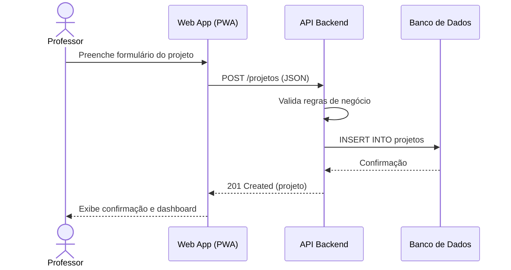
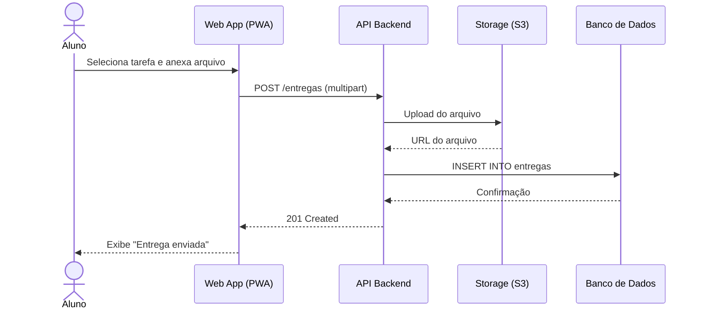
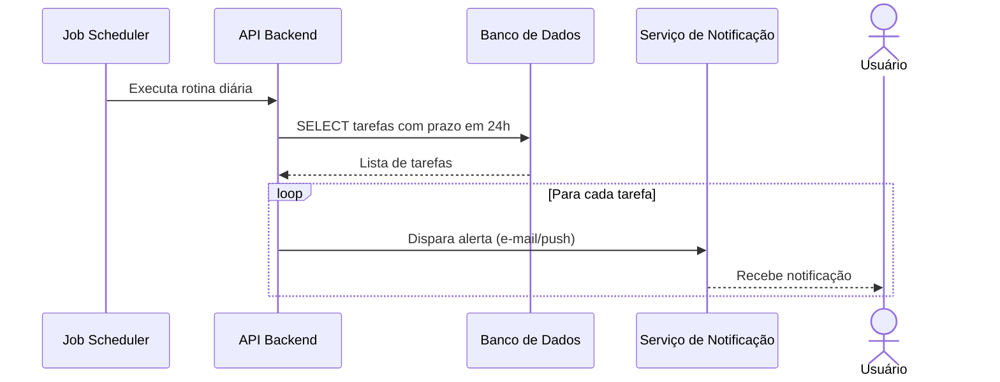

# 7. Rastreabilidade de Requisitos e Fluxos

## 7.1 Visão geral

A **Rastreabilidade** é o mecanismo que permite ligar os requisitos do sistema às decisões arquiteturais e de implementação. Este documento mapeia os principais cenários de uso (personas e histórias) aos fluxos de dados entre os containers e componentes do E-Project, garantindo que cada necessidade do usuário tenha uma contraparte técnica identificável.

---

## 7.2 Explicação geral

Para cada funcionalidade principal do sistema, foi identificado um **fluxo rastreável** que percorre as camadas do E-Project: desde a interface do usuário (PWA), passando pela API Backend, alcançando o banco de dados e, quando aplicável, integrando-se a sistemas externos.

Os fluxos foram numerados e associados às personas definidas no escopo do projeto:
- **Professor Victor Antunes** (orientador com múltiplos projetos);
- **Ana Beatriz** (aluna orientanda e bolsista);
- **Dr. Carlos Mendonça** (administrador institucional).

---

## 7.3 Matriz de Rastreabilidade

| ID | Cenário / Requisito | Persona | Containers Envolvidos | Componentes / Módulos |
| :--- | :--- | :--- | :--- | :--- |
| F01 | Criar novo projeto de pesquisa/extensão | Professor | PWA → API → DB | ProjetoModule, AuthModule |
| F02 | Definir cronograma e tarefas | Professor | PWA → API → DB | TarefaModule, ProjetoModule |
| F03 | Aluno visualiza tarefas e prazos | Aluno | PWA → API → DB | TarefaModule |
| F04 | Aluno anexa relatório/entrega | Aluno | PWA → API → DB + Storage | EntregaModule, Storage |
| F05 | Professor avalia entrega e dá feedback | Professor | PWA → API → DB | EntregaModule |
| F06 | Professor agenda reunião de orientação | Professor | PWA → API → DB | ReuniaoModule |
| F07 | Aluno confirma presença em reunião | Aluno | PWA → API → DB | ReuniaoModule |
| F08 | Sistema alerta sobre prazo próximo | Sistema | Jobs → API → Notificação | NotificacaoModule, Jobs |
| F09 | Consulta automática de editais | Sistema | Jobs → Portais UFAM | EditalModule, Jobs |
| F10 | Professor gera relatório final | Professor | PWA → API → DB + Storage | ProjetoModule, Storage |
| F11 | Administrador cadastra modalidade | Admin | PWA → API → DB | UsuarioModule, ConfigModule |

---

## 7.4 Diagramas de Sequência por Fluxo
Fluxo F01 — Criação de Projeto (Professor)

**Figura 1 — Sequência de criação de projeto.**
---

Fluxo F04 — Envio de Entrega (Aluno)

Figura 2 — Sequência de envio de entrega com upload de arquivo.
---

Fluxo F08 — Alerta de Prazo (Sistema Automático)

**Figura 3 — Sequência de disparo automático de alertas de prazo.**
---

## 7.5 Considerações Finais
A rastreabilidade aqui documentada garante que:

Cada persona tem seus cenários mapeados a fluxos técnicos concretos;
As decisões arquiteturais (containers, módulos, banco de dados) estão justificadas por requisitos de negócio;
É possível identificar rapidamente quais partes do sistema devem ser alteradas quando um requisito evoluir.
